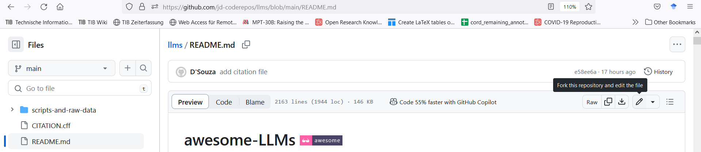

<!-- omit in toc -->

# awesome-LLMs [](https://awesome.re)

A compilation of AWESOME things of Large Language Models (LLMs) is presented. Each LLM is detailed through a structured summary, highlighting shared characteristics for easy comparison. This structured approach aligns with the next-generation scholarly communication standards, allowing seamless integration into any Scholarly Knowledge Graph (SKG). A prime example is the machine-actionable [review article](https://orkg.org/review/R609546) on the Open Research Knowledge Graph ([ORKG](https://orkg.org/)) or the [comprehensive comparison](https://orkg.org/comparison/R609337/) of LLMs.


## Table of Contents

- [awesome-LLMs](#awesome-LLMs-)
  - [Organizations](#Organizations)
	- [OpenAI](#openai)
	- [Google](#google)
	- [Google, and CMU](#google-and-cmu)
	- [Pengcheng Lab, and Baidu](#pengcheng-lab-and-baidu)
	- [Google, and University of Washington](#google-and-university-of-washington)
	- [Salesforce](#salesforce)
	- [Deepmind](#deepmind)
	- [Facebook](#facebook)
	- [Microsoft](#microsoft)
	- [Huggingface](#huggingface)
	- [Google, and Imperial College London](#google-and-imperial-college-london)
	- [Google, and Stanford](#google-and-stanford)
	- [NVidia](#nvidia)
	- [EleutherAI](#eleutherai)
	- [Facebook, Google, and UC Berkeley](#facebook-google-and-uc-berkeley)
	- [UC Berkeley](#uc-berkeley)
	- [AI21](#ai21)
	- [Anthropic](#anthropic)
	- [EleutherAI, Stability.ai, and LMU Munich](#eleutherai-stability.ai-and-lmu-munich)
	- [Amazon](#amazon)
	- [Tsinghua University](#tsinghua-university)
	- [BigScience](#bigscience)
	- [Huggingface, and Big Science](#huggingface-and-big-science)
	- [Meta](#meta)
	- [Meta AI, University of Washington, and University of Hong Kong](#meta-ai-university-of-washington-and-university-of-hong-kong)
	- [Meta AI](#meta-ai)
	- [Stanford University](#stanford-university)
	- [Large Model Systems Organization](#large-model-systems-organization)
	- [MosaicML](#mosaicml)
	- [BigCode Project](#bigcode-project)
	- [Technology Innovation Institute](#technology-innovation-institute)
	- [Berkeley AI Research](#berkeley-ai-research)
	- [Cerebras, Mohamed bin Zayed University of Artificial Intelligence, and Inception](#cerebras-mohamed-bin-zayed-university-of-artificial-intelligence-and-inception)


## Organizations

#### OpenAI

- [GPT-1](https://orkg.org/paper/R370535/R370538)

  ```yaml
  Title: Improving Language Understanding by Generative Pre-Training
  model family: GPT
  date created: 2018-06-01
  organization: OpenAI
  innovation: The paper introduces a framework for natural language understanding by first using generative pre-training on a diverse corpus and then fine-tuning for specific tasks. This approach improved state-of-the-art results on 9 out of 12 datasets, highlighting the potential of unsupervised learning combined with discriminative tasks.
  pretraining architecture: Decoder
  pretraining task: Causal language modeling
  fine-tuning task: Supervized discriminative finetuning
  training corpus: BookCorpus, Supervised Finetuning on several task-specific datasets for Natural Language Inference, Question Answering, Sentence similarity, and Classification.
  optimizer: Adam optimizer
  tokenization: byte pair encoding
  number of parameters: 117M
  maximum number of parameters (in million): 117
  application: Text generation, but adaptable to many other NLP tasks when fine tuned.
  has source code: https://github.com/openai/finetune-transformer-lm, https://huggingface.co/docs/transformers/model_doc/openai-gpt
  blog post: https://medium.com/@hyponymous/paper-summary-improving-language-understanding-by-generative-pre-training-7b77babd7086, https://www.reddit.com/r/MachineLearning/comments/n36htr/p_gpt1_annotated_paper_paper_summary/
  license: closed source
  research problem: Large Language Models (LLMs), transformer model
  ```

- [GPT-2](https://orkg.org/paper/R370861/R370862)

  ```yaml
  Title: Language models are unsupervised multitask learners
  model family: GPT
  date created: 2019-02-01
  organization: OpenAI
  innovation: It can generate upto 768 words (equivalent to 1 1/2 page), demonstrate that language models begin to learn tasks such as question answering, machine translation, reading comprehension, and summarization without any explicit supervision when trained on a task-agnostic, diverse dataset of millions of web-scraped webpages. The work proposes a central research question: do WebText LMs transfer well across domains and datasets?
  pretraining architecture: Decoder
  pretraining task: Causal language modeling
  training corpus: https://github.com/openai/gpt-2-output-dataset, 8 million web pages (40 GB). 10X GPT . WebText dataset is created by crawling all links at Reddit with at least 3 Karma points.
  tokenization: byte pair encoding
  number of parameters: 124M, 355M, 774M, 1.5B
  maximum number of parameters (in million): 1500
  extension: GPT-2 is a direct scale-up of GPT, with more than 10X the parameters and trained on more than 10X the amount of data., Minor extensions to the GPT architecture (e.g. layer normalization moved to the input of each sub-layer, or increased context size from 512 to 1024)
  application: Text generation, but adaptable to many other NLP tasks when fine tuned.
  has source code: https://huggingface.co/docs/transformers/model_doc/gpt2
  blog post: https://openai.com/research/better-language-models, https://www.philschmid.de/fine-tune-a-non-english-gpt-2-model-with-huggingface
  license: closed source
  research problem: Large Language Models (LLMs), transformer model
  ```

- [GPT-3](https://orkg.org/paper/R370897/R370898)

  ```yaml
  Title: Language Models are Few-Shot Learners
  model family: GPT
  date created: 2020-05-01
  organization: OpenAI
  innovation: GPT-3's primary innovation in the context of Large Language Models is its exceptional few-shot learning capabilities, allowing it to make accurate predictions using just a natural language prompt and a few task demonstrations. The model also introduced prompt-based and in-context learning methodologies. However, its vast size (175B parameters) poses challenges for real-world applications., It can generate upto 1,536 words (equivalent to 3 pages)
  pretraining architecture: Decoder
  pretraining task: Causal language modeling
  training corpus: ~ 500B tokens including CommonCrawl (410B), WebText2 (19B), Books1 (12B), Books2 (55B), and Wikipedia (3B)
  number of parameters: 125M, 350M, 774M, 1.3B, 2.7B, 6.7B, 13B, 175B
  maximum number of parameters (in million): 175000
  hardware used: Nvidia V100 GPU
  hardware information: All models were trained on V100 GPU’s on part of a high-bandwidth cluster provided by Microsoft.
  extension: Same as GPT-2 with the only addition of alternating dense and locally banded sparse attention patterns, inspired by the Sparse Transformer
  application: Initially text generation, but has over time been used for a large range of applications in areas such as code generation, but also image and audio generation
  has source code: https://platform.openai.com/docs/models/gpt-3-5, https://github.com/openai/gpt-3
  blog post: https://medium.com/analytics-vidhya/openai-gpt-3-language-models-are-few-shot-learners-82531b3d3122, https://openai.com/blog/gpt-3-apps
  license: closed source
  research problem: Large Language Models (LLMs), transformer model
  ```

- [DALL-E](https://orkg.org/paper/R370903/R370904)

  ```yaml
  Title: Zero-Shot Text-to-Image Generation
  model family: GPT
  date created: 2021-01-01
  organization: OpenAI
  innovation: The paper introduces a model with remarkable generalization, capable of creatively interpreting and combining unusual textual concepts into images. It also demonstrates combinatorial generalization and zero-shot image-to-image translation controlled by natural language, showcasing advancements in LLMs for text-to-image synthesis.
  pretraining architecture: Decoder
  pretraining task: Caption prediction
  training corpus: 250 million text-images pairs from the internet
  optimizer: Adam optimizer
  tokenization: BPE-ecnode
  number of parameters: 12B
  maximum number of parameters (in million): 12000
  hardware used: NVIDIA V100 (16GB) GPU
  extension: A differential variational auto-encoder is used to learn the visual codebook. The transformer is a variation of GPT-3
  application: Text to image
  has source code: https://github.com/openai/DALL-E, https://github.com/borisdayma/dalle-mini
  blog post: https://openai.com/blog/dall-e/, https://ml.berkeley.edu/blog/posts/dalle2/
  license: N/A
  research problem: Large Language Models (LLMs), transformer model
  ```

- [CLIP](https://orkg.org/paper/R370907/R370908)

  ```yaml
  Title: Learning Transferable Visual Models From Natural Language Supervision
  model family: Also using Resnet, ViT, and vanilla transformer for text, CLIP
  date created: 2021-02-01
  organization: OpenAI
  innovation: CLIP, in the context of Large Language Models, introduces a novel approach by leveraging natural language supervision with a dataset of 400 million (image, text) pairs. It excels in zero-shot learning, allowing it to classify images using textual descriptions without prior training on specific categories. This integration of vision and language offers a flexible, scalable solution with potential for diverse applications.
  pretraining architecture: Encoder
  pretraining task: predict which of the N × N possible (image, text) pairings across a batch actually occurred
  training corpus: WIT (WebImageText) - 400 million text,image pairs
  optimizer: Adam optimizer
  hardware used: Nvidia V100 GPU
  hardware information: The largest ResNet model, RN50x64, took 18 days to train on 592 V100 GPUs while the largest Vision Transformer took 12 days on 256 V100 GPUs.
  extension: Combines Resnet and ViT for the visual encoding with Transformer for the Textual encoder
  application: Image/Object classification
  has source code: https://github.com/openai/CLIP, https://huggingface.co/docs/transformers/model_doc/clip
  blog post: https://openai.com/research/clip, https://medium.com/axinc-ai/clip-learning-transferable-visual-models-from-natural-language-supervision-4508b3f0ea46
  license: Open, MIT license
  research problem: Large Language Models (LLMs), transformer model
  ```

- [GLIDE](https://orkg.org/paper/R370931/R370932)

  ```yaml
  Title: GLIDE: Towards Photorealistic Image Generation and Editing with Text-Guided Diffusion Models
  model family: Diffusion models
  date created: 2021-12-01
  organization: OpenAI
  innovation: The paper introduces two guidance techniques for text-guided image synthesis: CLIP guidance and classifier-free guidance. Of the two, classifier-free guidance produces higher-quality, photorealistic images that align closely with textual descriptions, outperforming previous models like DALL-E in evaluations.
  pretraining architecture: Encoder
  pretraining task: Caption prediction
  training corpus: Same as DALL-E
  number of parameters: 3.5B diffusion model (2.3B for visual encoding, 1.2B for textual) + 1.5B for model for upsampling
  maximum number of parameters (in million): 3500
  extension: GLIDE can be seen as an extension of the ADM (Ablated Diffusion Model) by the same authors. However, ADM is not per se a transformer architecture although it does resemble one in some of the configurations the authors use. Given that ADM is by the same authors and was quickly followed up by GLIDE, I think it is fair to consider GLIDE as the first of its kind.
  application: Text to image
  has source code: https://github.com/openai/glide-text2im
  license: Open, MIT license
  research problem: Large Language Models (LLMs), transformer model
  ```

- [InstructGPT](https://orkg.org/paper/R370985/R370986)

  ```yaml
  Title: Training language models to follow instructions with human feedback
  model family: GPT
  date created: 2022-01-01
  organization: OpenAI
  innovation: Better alignment of LLMs with human expectations using reinforcement learning through human feedback
  pretraining architecture: Decoder
  pretraining task: Causal language modeling
  fine-tuning task: Reinforcement Learning from Human Feedback
  training corpus: Same as GPT3 for pretraining, but finetuned and optimized using labeler data and prompts
  number of parameters: Same as GPT3
  extension: GPTInstruct starts off with a pretrained GPT3 model and adds reward modeling through reinforcement learning after a supervised finetuning
  application: Knowledge-intensive dialog or language tasks
  has source code: https://github.com/openai/following-instructions-human-feedback
  blog post: https://sh-tsang.medium.com/review-instructgpt-training-language-models-to-follow-instructions-with-human-feedback-7fce4bf9059a, https://openai.com/research/instruction-following
  license: Closed source, accessible through API
  research problem: Large Language Models (LLMs), transformer model
  ```

- [DALL-E 2](https://orkg.org/paper/R370957/R370958)

  ```yaml
  Title: Hierarchical Text-Conditional Image Generation with CLIP Latents
  model family: GLIDE, CLIP
  date created: 2022-04-01
  organization: OpenAI
  pretraining architecture: Encoder/Decoder
  pretraining task: Caption prediction
  training corpus: Combination of the DALL-E and CLIP datasets
  number of parameters: 3.5B
  maximum number of parameters (in million): 3500
  extension: Combines CLIP encoder and Diffusion decoder similar to GLIDE
  application: Text to image
  blog post: https://openai.com/product/dall-e-2, https://labs.openai.com/
  license: Closed source, accessible through API
  research problem: Large Language Models (LLMs), transformer model
  ```

- [ChatGPT](https://orkg.org/paper/R606142)

  ```yaml
  Title: Introducing ChatGPT
  model family: GPT
  date created: 2022-11-30
  organization: OpenAI
  innovation: trained using Reinforcement Learning from Human Feedback (RLHF) to obtain better model alignment, It can generate upto 3000 words (equivalent to 6 pages), Supports input context length of 2048 tokens
  pretraining architecture: Decoder
  pretraining task: Causal language modeling
  fine-tuning task: Step 3. RLHF using Proximal Policy Optimization, Step 2. Collect comparison data and train a reward model, Step 1. Supervized fine-tuning
  training corpus: Human written prompt and interaction dataset collected through the OpenAI API
  number of parameters: 175B
  maximum number of parameters (in million): 175000
  hardware information: trained on an Azure AI supercomputing infrastructure
  application: provide human-like conversational interactions and assist users in answering questions, generating text, providing recommendations, and engaging in natural language conversations.
  blog post: https://openai.com/blog/chatgpt
  license: Closed source, accessible through API
  research problem: transformer model, Large Language Models (LLMs)
  ```

- [GPT-4](https://orkg.org/paper/R603883)

  ```yaml
  Title: GPT-4 Technical Report
  model family: GPT
  date created: 2023-03-14
  organization: OpenAI
  innovation: It can generate upto 24000 words (equivalent to 48 pages), Supports input context length between 8192 and 32,768 tokens depending on the model version
  pretraining architecture: Decoder
  pretraining task: Causal language modeling
  fine-tuning task: Reinforcement Learning from Human Feedback, Rule-Based Reward Model
  number of parameters: 170T
  maximum number of parameters (in million): 170000000
  extension: a large-scale, multimodal model which can accept image and text inputs and produce text outputs
  application: Creating highly realistic and contextually accurate human-like text generation
  blog post: https://openai.com/research/gpt-4
  license: Closed source, accessible through API
  research problem: transformer model, Large Language Models (LLMs)
  ```

----------------------------------------
#### Google

- [BERT](https://orkg.org/paper/R370558)

  ```yaml
  Title: BERT: Pre-training of Deep Bidirectional Transformers for Language Understanding
  model family: BERT
  date created: 2018-10-01
  organization: Google
  innovation: BERT's primary innovation in Language Model Learning is the "masked language model" (MLM) approach, inspired by the Cloze task. This method masks random tokens in a sentence and trains the model to predict them, enabling bidirectional context understanding.
  pretraining architecture: Encoder
  pretraining task: Masked Language Modeling
  fine-tuning task: Next Sentence Prediction
  training corpus: Toronto Book Corpus and Wikipedia (3.3B Tokens)
  optimizer: Adam optimizer
  tokenization: WordPiece
  number of parameters: Base = 110M, Large = 340M
  maximum number of parameters (in million): 340
  application: General Language Understanding and Question Answering. Many other language applications followed
  has source code: https://huggingface.co/docs/transformers/model_doc/bert
  blog post: https://colab.research.google.com/github/NielsRogge/Transformers-Tutorials/blob/master/BERT/Fine_tuning_BERT_(and_friends)_for_multi_label_text_classification.ipynb, https://www.philschmid.de/bert-text-classification-in-a-different-language
  license: Open, Apache 2.0
  research problem: Large Language Models (LLMs), transformer model
  ```

- [ALBERT](https://orkg.org/paper/R370867/R370868)

  ```yaml
  Title: ALBERT: A Lite BERT for Self-supervised Learning of Language Representations
  model family: BERT
  date created: 2019-09-01
  organization: Google
  innovation: The main innovation of the work is ALBERT, a language model that improves on existing large models like BERT by employing parameter reduction techniques, such as factorized embeddings and cross-layer parameter sharing. This allows ALBERT to achieve better performance and efficiency on natural language understanding tasks by training larger models with fewer parameters.
  pretraining architecture: Encoder
  pretraining task: Next Sentence Prediction, Masked Language Modeling
  training corpus: Same as BERT
  optimizer: LAMB optimizer
  tokenization: sentencepiece
  number of parameters: Base = 12M, Large = 18M, XLarge = 60M
  maximum number of parameters (in million): 60
  hardware used: Cloud TPUv3
  extension: Compressed version of BERT using parameter sharing, which is much more efficient given the same number of parameters
  application: Same as BERT
  has source code: https://github.com/google-research/albert, https://huggingface.co/docs/transformers/model_doc/albert
  blog post: https://ai.googleblog.com/2019/12/albert-lite-bert-for-self-supervised.html
  license: Open, Apache 2.0
  research problem: Large Language Models (LLMs), transformer model
  ```

- [T5](https://orkg.org/paper/R370878)

  ```yaml
  Title: Exploring the limits of transfer learning with a unified text-to-text transformer
  model family: T5
  date created: 2019-10-01
  organization: Google
  innovation: The main innovation of Google's T5 language model is its "text-to-text" framework, where various tasks are formulated as converting input text to output text. This unified approach allows T5 to achieve state-of-the-art performance on diverse tasks without task-specific modifications, simplifying training and deployment. This innovation enhances efficiency and effectiveness in real-world applications of large language models.
  pretraining architecture: Encoder/Decoder
  pretraining task: Span Corruption
  fine-tuning task: finetuning on downstream tasks one at a time
  training corpus: Colossal Clean Crawled Corpus
  optimizer: AdaFactor
  tokenization: sentencepiece
  number of parameters: 60M, 220M, 770M, 3B, and 11B
  maximum number of parameters (in million): 11000
  hardware used: TPUv3
  hardware information: we use a combination of model and data parallelism and train models on “slices” of Cloud TPU Pods. TPU pods are are multi-rack ML  supercomputers that contain 1,024 TPU v3 chips connected via a high-speed 2D mesh interconnect with supporting CPU host machines.
  extension: Same as original Transformer with some additions such as relative positional embeddings like Transformer XL
  application: Diverse set of downstream tasks including machine translation, question answering, abstractive summarization, and text classification
  has source code: https://github.com/google-research/text-to-text-transfer-transformer, https://huggingface.co/docs/transformers/model_doc/t5
  blog post: https://ai.googleblog.com/2020/02/exploring-transfer-learning-with-t5.html
  license: Apache 2.0
  research problem: Large Language Models (LLMs), transformer model
  ```

- [Big Bird](https://orkg.org/paper/R370899/R370900)

  ```yaml
  Title: Big Bird: Transformers for Longer Sequences
  model family: BERT
  date created: 2020-07-01
  organization: Google
  innovation: BigBird introduces a sparse attention mechanism, allowing it to efficiently handle sequences up to 8 times longer than traditional models like BERT. It combines global, sliding window, and random attention patterns to capture both local and long-range dependencies. This innovation enables superior performance on various NLP tasks without sacrificing efficiency.
  pretraining architecture: Encoder
  pretraining task: Masked Language Modeling
  training corpus: Books, CC-News, Stories and Wikipedia
  tokenization: byte pair encoding
  number of parameters: Depends on the overall architecture
  extension: Big Bird can extend other architectures such as BERT, Pegasus, or RoBERTa by using a sparse attention mechanism that elminates the quadratic dependency thus making it more suitable for longer sequences
  application: Particularly well suited for longer sequences, not only in text but also e.g. in genomics
  has source code: https://github.com/google-research/bigbird, https://huggingface.co/docs/transformers/model_doc/big_bird
  blog post: https://ai.googleblog.com/2021/03/constructing-transformers-for-longer.html, https://huggingface.co/blog/big-bird
  license: Open, Apache 2.0
  research problem: Large Language Models (LLMs), transformer model
  ```

- [ViT](https://orkg.org/paper/R370901/R370902)

  ```yaml
  Title: An Image is Worth 16x16 Words: Transformers for Image Recognition at Scale
  model family: BERT
  date created: 2020-10-01
  organization: Google
  innovation: The Vision Transformer (ViT) applies Transformers, typically used in NLP, directly to image patches without image-specific biases. It excels when pre-trained on larger datasets, outperforming traditional convolutional models like ResNets. This approach challenges the dominance of convolutional architectures in computer vision, mirroring the Transformer's rise in NLP.
  pretraining architecture: Encoder
  pretraining task: image classification
  training corpus: From standard Imagenet to JFT-300M (large inhouse dataset)
  optimizer: Adam optimizer
  number of parameters: 86M(Base) to 632M (Huge)
  maximum number of parameters (in million): 632
  hardware used: Cloud TPUv3
  hardware information: the ViT-L/16 model pre-trained on the public ImageNet-21k dataset could be trained using a standard cloud TPUv3 with 8 cores in approximately 30 days.
  extension: Extension of BERT architecture to train on patches of images
  application: image classification
  has source code: https://github.com/google-research/vision_transformer, https://huggingface.co/docs/transformers/model_doc/vit
  blog post: https://www.v7labs.com/blog/vision-transformer-guide
  license: N/A
  research problem: Large Language Models (LLMs), transformer model
  ```

- [Switch](https://orkg.org/paper/R216396/R370905)

  ```yaml
  Title: Switch Transformers: Scaling to Trillion Parameter Models with Simple and Efficient Sparsity
  model family: T5
  date created: 2021-01-01
  organization: Google
  innovation: The Switch Transformer introduces a sparsely-activated model approach, enhancing the Mixture of Experts (MoE) models by simplifying their routing algorithm and reducing computational costs. It enables training large models with lower precision formats like bfloat16 and achieves up to 7x faster pre-training speeds. This innovation pushes LLM boundaries, scaling up to trillion parameter models with significant efficiency gains.
  pretraining architecture: Encoder/Decoder
  pretraining task: denoising autoencoder
  training corpus: Colossal Clean Crawled Corpus
  number of parameters: 1T
  maximum number of parameters (in million): 1000000
  hardware used: TPUv3
  hardware information: All models are trained with the same amount of computation (32 cores) and on the same hardware (TPUv3).
  extension: Goal to increase parameter count while keeping FLOP operations constant by using efficient routing of MoE (Mixture of Experts)
  application: General language tasks (e.g. question answering)
  has source code: https://github.com/google-research/t5x, https://github.com/tensorflow/mesh/blob/master/mesh_tensorflow/transformer/moe.py
  blog post: https://www.alexanderthamm.com/en/blog/switch-transformer-upscaling-to-over-a-billion-parameters/
  license: Open, Apache 2.0
  research problem: Large Language Models (LLMs), transformer model
  ```

- [GLaM](https://orkg.org/paper/R370929/R370930)

  ```yaml
  Title: GLaM: Efficient Scaling of Language Models with Mixture-of-Experts
  model family: Transformer
  date created: 2021-12-01
  organization: Google
  innovation: GLaM introduces a sparsely activated mixture-of-experts architecture, allowing it to scale to 1.2 trillion parameters while consuming only 1/3 of GPT-3's training energy. Despite its size, it achieves superior performance on 29 NLP tasks and is more energy-efficient than dense models like GPT-3.
  pretraining architecture: Decoder
  pretraining task: Causal language modeling
  training corpus: 1.6T tokens including web pages filtered by Wikipedia and books for quality
  optimizer: AdaFactor
  tokenization: sentencepiece
  number of parameters: 1.2T across 64 experts, but only 96B get activated for inference
  maximum number of parameters (in million): 1200000
  hardware used: cloud TPU-v4
  hardware information: the GLaM (64B/64E) training after 600B tokens consumes 456 MWh, about 1/3 of the energy cost of 1287 MWh used by GPT-3. Moreover, to reach similar (and slightly exceeded) scores as GPT-3, we train using 1,024 TPU-v4 chips for 574 hours (with 280B tokens). This consumes 213 MWh or 1/6 of the GPT-3 energy cost.
  extension: GLaM introduces a Mixture of 64 Experts to increase parameter count and generalization properties in a somewhat standard decoder-only. Transformer architecture. Only two experts get activated at a time per token, which makes the model also more efficient in training and inference.
  application: General language modeling - tested across 29 NLP tasks
  blog post: https://ai.googleblog.com/2021/12/more-efficient-in-context-learning-with.html
  license: closed source
  research problem: Large Language Models (LLMs), transformer model
  ```

- [LAMDA](https://orkg.org/paper/R370942)

  ```yaml
  Title: LaMDA: Language Models for Dialog Applications
  model family: LaMDA-PT
  date created: 2022-01-01
  organization: Google
  innovation: LaMDA is a specialized dialog model that emphasizes safety and factual grounding. The model's innovation lies in its fine-tuning with annotated data and its ability to consult external knowledge sources. This approach aims to produce more accurate and safer dialog responses compared to traditional LLMs.
  pretraining architecture: Decoder
  pretraining task: Causal language modeling
  fine-tuning task: based on multi-turn crowdsourced dialog datasets, LaMDA-PT is finetuned in a mix of generative tasks that generate response given contexts, and discriminative tasks that evaluate quality and safety of a response in context 
  training corpus: 1.56T words from public dialog data and other public web documents. Overall, it consists of 2.97B documents, 1.12B dialogs, and 13.39B dialog utterances, for a total of 1.56T words
  tokenization: sentencepiece
  number of parameters: 137B
  maximum number of parameters (in million): 137000
  hardware used: TPUv3
  hardware information: LaMDA was pretrained on 1024 TPU-v3 chips for a total of about 57.7 days, and 256K tokens per batch
  extension: LAMDA focuses on how to improve safety, quality, and groundeness using different fine-tuning strategies
  application: General language modeling, such as translation, summarization, question and answers
  has source code: https://github.com/conceptofmind/LaMDA-rlhf-pytorch
  blog post: https://ai.googleblog.com/2022/01/lamda-towards-safe-grounded-and-high.html, https://blog.google/technology/ai/lamda/
  license: closed source
  research problem: Large Language Models (LLMs), transformer model
  ```

- [FLAN](https://orkg.org/paper/R376011)

  ```yaml
  Title: Finetuned language models are zero-shot learners
  model family: LaMDA-PT
  date created: 2022-02-08
  organization: Google
  innovation: The primary innovation of FLAN in the context of Large Language Models is instruction tuning, where models are finetuned on datasets described via natural language instructions. This method significantly enhances zero-shot learning abilities, with FLAN outperforming the 175B GPT-3 on numerous tasks. The approach emphasizes human-like prompts over traditional model-specific prompts used in models like GPT-3 and T5.
  pretraining architecture: Decoder
  fine-tuning task: Instruction Tuning
  training corpus: FLAN is instruction tuned on 25 tasks spanning 62 datasets., LaMDA-PT is is pretrained on a collection of web documents (including those with computer code), dialog data, and Wikipedia, tokenized into 2.49T BPE tokens with a 32k vocabulary
  optimizer: AdaFactor
  tokenization: sentencepiece
  number of parameters: 137B
  maximum number of parameters (in million): 137000
  hardware used: TPUv3
  hardware information: instruction tuning takes around 60 hours on a TPUv3 with 128 cores
  extension: Zero-shot task learning. The output space for a given task is either one of several classes (classification) or free text (generation).
  application: language understanding and generation tasks such as inference, sentiment analysis, paraphrase, closed-book QA, reading comprehension, coreference, summarization, translation, commonsense reasoning, and struct-to-text
  has source code: https://github.com/google-research/FLAN
  blog post: http://rylanschaeffer.github.io/blog_posts/2022-01-20-google-brain-flan.html, https://ai.googleblog.com/2021/10/introducing-flan-more-generalizable.html
  license: Apache 2.0
  research problem: Large Language Models (LLMs), transformer model
  ```

- [PaLM](https://orkg.org/paper/R370963/R370964)

  ```yaml
  Title: PaLM: Scaling Language Modeling with Pathways
  model family: PaLM
  date created: 2022-04-01
  organization: Google
  innovation: To demonstrate the first large-scale use of Pathways -- a new ML system which enables training a single model across thousands or tens of thousands of accelerator chips in a highly efficient manner. With Pathways, they trained a 540B parameter language model on 6144 TPU v4 chips at efficiency levels that could not be reached before for models of this scale. E.g., GPT-3 (175B), Gopher (280B), Megatron-Turing-NLG (530B).
  pretraining architecture: Decoder
  pretraining task: Causal language modeling
  training corpus: 780B tokens from multilingual social media conversations (50%), multilingual filtered webpages (27%), books in English (13%), code from Github (5%), multilingual Wikipedia (4%), and news in English (1%). Code includes 24 programming languages.
  optimizer: AdaFactor
  tokenization: sentencepiece
  number of parameters: 8B, 62B, and 540B
  maximum number of parameters (in million): 540000
  hardware used: TPUv4
  hardware information: PaLM 540B is trained over two TPU v4 Pods connected over data center network (DCN) using a combination of model and data parallelism. Each Pod has 3072 TPU v4 chips attached to 768 hosts.
  extension: PaLM uses a typical decoder-only transformer architecture, but adds quite a few extensions: SwiGLU activations, parallel layers, multi-query attention, RoPE embeddings, Shared Input-Output Embeddings, no biases, and a 256k SentencePiece vocabulary generated from the training data
  application: PaLM is designed as a general purpose language model with applicability to hundreds of different language tasks
  has source code: https://github.com/lucidrains/PaLM-pytorch
  blog post: https://blog.google/technology/ai/introducing-pathways-next-generation-ai-architecture/, https://ai.googleblog.com/2022/04/pathways-language-model-palm-scaling-to.html
  license: closed source
  research problem: Large Language Models (LLMs), transformer model
  ```

- [UL2](https://orkg.org/paper/R595146)

  ```yaml
  Title: Ul2: Unifying language learning paradigms
  model family: Transformer
  date created: 2022-05-01
  organization: Google
  innovation: The paper introduces the UL2 model, a unified framework for pre-training in NLP, featuring a novel Mixture-of-Denoisers (MoD) objective. This objective smoothly integrates various pre-training paradigms, such as span corruption and prefix language modeling. Additionally, UL2 introduces dynamic "mode switching" between different denoisers and showcases superior performance across diverse NLP tasks.
  pretraining architecture: Encoder/Decoder
  pretraining task: Mixture-of-Denoisers, which combines diverse pretraining paradigms together
  training corpus: 1 trillion tokens on C4
  optimizer: AdaFactor
  tokenization: sentencepiece
  number of parameters: 20B
  maximum number of parameters (in million): 20000
  hardware used: TPUv4
  hardware information: We use a batch size of 1024 and 512 TPUv4 chips for pretraining this model. UL20B is trained with Jax and T5X infrastructure. We release and open source T5X-based model checkpoints of this 20B model
  extension: UL2-20B (Unifying Language Learning) can be interpreted as a model that is quite similar to T5 but trained with a different objective and slightly different scaling knobs.
  application: A unified framework for pre-training models that are universally effective across datasets and setups.
  has source code: https://github.com/google-research/google-research/tree/master/ul2
  blog post: https://blog.research.google/2022/10/ul2-20b-open-source-unified-language.html
  license: Open, Apache 2.0
  research problem: Large Language Models (LLMs), transformer model
  ```

- [Imagen](https://orkg.org/paper/R370975/R370976)

  ```yaml
  Title: Photorealistic Text-to-Image Diffusion Models with Deep Language Understanding
  model family: Diffusion models, CLIP, T5
  date created: 2022-06-01
  organization: Google
  innovation: The "Imagen" model innovatively merges transformer language models with high-fidelity diffusion techniques to produce photorealistic images from text descriptions. This demonstrates that embeddings from text-only pretrained large language models are highly effective for text-to-image synthesis.
  pretraining architecture: T5 (or CLIP or BERT) for frozen text encoder + U-net architecture for cascaded diffusion models for text to image
  pretraining task: image/text pair prediction
  training corpus: a combination of internal datasets, with ? 460M image-text pairs, and the publicly available Laion dataset, with ? 400M image-text pairs
  optimizer: AdaFactor
  number of parameters: 2B
  maximum number of parameters (in million): 2000
  hardware used: TPUv4
  hardware information: use 256 TPU-v4 chips for our base 64 x 64 model, and 128 TPU-v4 chips for both super-resolution models
  extension: Imagen adds a few extensions to the U-net diffusion architecture (pooled embedding vector, cross attention over text embeddings, and Layer Normalizations)
  application: Text to image
  blog post: https://imagen.research.google/
  license: closed source
  research problem: Large Language Models (LLMs), transformer model
  ```

- [Minerva](https://orkg.org/paper/R370978)

  ```yaml
  Title: Solving Quantitative Reasoning Problems with Language Models
  model family: PaLM
  date created: 2022-06-01
  organization: Google
  pretraining architecture: Decoder
  pretraining task: Causal language modeling
  training corpus: Same as PaLM + 118GB dataset of scientific papers from the arXiv preprint server and web pages that contain mathematical expressions using LaTeX, MathJax, or other mathematical typesetting formats
  number of parameters: 540B
  maximum number of parameters (in million): 540000
  extension: Extends PaLM by fine-tuning on the mathematical dataset
  application: Mathematical reasoning
  blog post: https://ai.googleblog.com/2022/06/minerva-solving-quantitative-reasoning.html
  license: closed source
  research problem: Large Language Models (LLMs), transformer model
  ```

- [Flan-T5](https://orkg.org/paper/R375926/R375931)

  ```yaml
  Title: Scaling instruction-finetuned language models
  model family: T5
  date created: 2022-11-01
  organization: Google
  innovation: this paper explores instruction finetuning with a particular focus on (1) scaling the number of tasks (1.8K fine-tuning tasks), (2) scaling the model size, and (3) finetuning on chain-of-thought data. This approach is compatible with various model sizes and architectures, with Flan-T5 models notably outperforming baseline T5 models.
  pretraining architecture: Encoder/Decoder
  pretraining task: Span Corruption
  fine-tuning task: Instruction Tuning
  training corpus: Flan finetuned with tasks in Muffin, T0-SF, NIV2, and CoT
  optimizer: AdaFactor
  number of parameters: 80M (Flan-T5-Small), 250M (Flan-T5-Base), 780M (FLan-T5-Large), 3B (Flan-T5-XL), and 11B (Flan-T5-XXL).
  maximum number of parameters (in million): 11000
  hardware used: TPUv3
  extension: instruction finetuning with a particular focus on (1) scaling the number of tasks, (2) scaling the model size, and (3) finetuning on chain-of-thought data
  application: The primary use is to underestand how to improve large language models with the right kind of instruction fine-tuning. The focus is research on zero-shot and in-context few-shot learning NLP tasks, such as reasoning, and question answering; advancing fairness and safety research, and understanding limitations of current large language models
  has source code: https://github.com/google-research/t5x, https://huggingface.co/docs/transformers/model_doc/flan-t5
  blog post: https://ai.googleblog.com/2023/02/the-flan-collection-advancing-open.html
  license: Apache 2.0
  research problem: Large Language Models (LLMs), transformer model
  ```

- [Flan-PaLM](https://orkg.org/paper/R375926/R595030)

  ```yaml
  Title: Scaling instruction-finetuned language models
  model family: PaLM
  date created: 2022-11-01
  organization: Google
  innovation: The paper introduced an extended instruction fine-tuning for the Flan-PaLM model, scaling it to a 540B-parameter size and 1.8K fine-tuning tasks. They incorporated chain-of-thought (CoT) data, which enhanced performance across evaluations. This approach is compatible with various model sizes and architectures
  pretraining architecture: Decoder
  pretraining task: Causal language modeling
  fine-tuning task: Instruction Tuning
  training corpus: Flan finetuned with tasks in Muffin, T0-SF, NIV2, and CoT
  optimizer: AdaFactor
  number of parameters: 8B, 62B, 540B
  maximum number of parameters (in million): 540000
  hardware used: TPUv4
  hardware information: use 0.2% of the pre-training compute to instruction-finetune Flan-PaLM 540B (approximately 512 v4 TPU chips for 37 hours)
  extension: Flan-PaLM is generated by "Flan Finetuning" the PaLM models: (1) scaling the number of tasks to 1,836, (2) scaling the model size, and (3) finetuning on chain-of-thought data.
  application: Same as Flan-T5. The goal is to show Flan finetuning can even improve on the largest Google LMs (+9.4% improvement average across tasks), with improvements to chain of thought, self consistency, multilingual tasks, arithmetic reasoning
  license: closed source
  research problem: Large Language Models (LLMs), transformer model
  ```

----------------------------------------
#### Google, and CMU

- [Transformer XL](https://orkg.org/paper/R370542/R370546)

  ```yaml
  Title: Transformer-XL: Attentive Language Models Beyond a Fixed-Length Context
  date created: 2019-01-01
  organization: Google, CMU
  innovation: Transformer-XL introduces a segment-level recurrence mechanism and a novel positional encoding scheme to overcome the fixed-length context limitations of traditional Transformers. This allows it to capture dependencies 80% longer than RNNs and 450% longer than vanilla Transformers, addressing context fragmentation and improving efficiency in language modeling.
  pretraining architecture: Decoder
  pretraining task: Causal language modeling
  training corpus: Different training datasets depending on experiments, but baseline is Wikitext-103
  tokenization: byte pair encoding
  number of parameters: 151M
  maximum number of parameters (in million): 151
  hardware information: state-of-the-art results reported in the paper were obtained by training the model on a large-scale TPU cluster
  extension: Relative positioned embeddings enable longer-context attention when compared to vanilla Transformer model
  application: General language tasks
  has source code: https://github.com/chiayewken/transformer_xl, https://huggingface.co/docs/transformers/model_doc/transfo-xl
  blog post: https://ai.googleblog.com/2019/01/transformer-xl-unleashing-potential-of.html
  license: N/A
  research problem: Large Language Models (LLMs), transformer model
  ```

- [XLNet](https://orkg.org/paper/R130126/R370865)

  ```yaml
  Title: XLNet: Generalized Autoregressive Pretraining for Language Understanding
  model family: Transformer XL
  date created: 2019-05-01
  organization: Google, CMU
  innovation: XLNet introduces a generalized autoregressive pretraining method that captures bidirectional context by considering all possible permutations of the factorization order. This approach overcomes BERT's limitations related to data corruption and token independence. Additionally, XLNet integrates techniques from Transformer-XL and offers architectural improvements for permutation-based modeling.
  pretraining architecture: Decoder
  pretraining task: Causal language modeling
  training corpus: Same as BERT + Giga5 (16GB text), and and aggressively filtered ClueWeb 2012-B (19GB), Common Crawl (110 GB)
  optimizer: Adam weight decay optimizer
  number of parameters: Base=117M, Large=360M
  maximum number of parameters (in million): 360
  hardware used: TPUv3
  hardware information: train on 512 TPU v3 chips for 500K steps with an Adam weight decay optimizer, linear learning rate decay, and a batch size of 8192, which takes about 5.5 days
  extension: This model basically adapts Transformer XL architecture to permutation-based LM
  application: General language tasks
  has source code: https://huggingface.co/docs/transformers/model_doc/xlnet
  blog post: https://towardsdatascience.com/xlnet-explained-in-simple-terms-255b9fb2c97c
  license: Open, MIT license
  research problem: Large Language Models (LLMs), transformer model
  ```

----------------------------------------
#### Pengcheng Lab, and Baidu

- [ERNIE](https://orkg.org/paper/R575541/R595026)

  ```yaml
  Title: ERNIE: Enhanced Language Representation with Informative Entities
  model family: BERT
  date created: 2019-05-01
  organization: Pengcheng Lab, Baidu
  innovation: ERNIE innovatively incorporates knowledge from knowledge graphs (KGs) into language representation models. It fuses lexical, syntactic, and knowledge information, enabling enhanced performance on knowledge-driven tasks. This approach sets ERNIE apart from traditional models like BERT, which primarily rely on textual context.
  pretraining architecture: Encoder
  pretraining task: Masked Language Modeling
  training corpus: English Wikipedia + Wikidata for entitites (note that they initialize model to original BERT parameter values
  optimizer: Adam optimizer
  number of parameters: Ernie-ViLG 2.0 = 10B, Ernie 3.0 Titan = 260B
  maximum number of parameters (in million): 260000
  extension: Uses BERT for Encoder architecture, but stacks and aggregates two of them for text and entities. This architecture could be understood as BERT for text + knowledge graphs
  application: Knowledge intensive related tasks that might benefit from knowledge graphs or entities such as entity recognition
  has source code: https://github.com/thunlp/ERNIE
  blog post: http://research.baidu.com/Blog/index-view?id=160
  license: closed source
  research problem: Large Language Models (LLMs), transformer model
  ```

----------------------------------------
#### Google, and University of Washington

- [RoBERTa](https://orkg.org/paper/R197288/R370866)

  ```yaml
  Title: RoBERTa: A Robustly Optimized BERT Pretraining Approach
  model family: BERT
  date created: 2019-07-01
  organization: Google, University of Washington
  innovation: The work introduced RoBERTa, an improved version of BERT, by optimizing design choices: extending training duration, removing the next sentence prediction objective, and dynamically altering the masking pattern. These modifications led RoBERTa to achieve state-of-the-art results on benchmarks like GLUE, RACE, and SQuAD, emphasizing the importance of refining pretraining strategies in Large Language Models.
  pretraining architecture: Encoder
  pretraining task: Masked Language Modeling
  training corpus: Same as BERT + CC News + OpenWebText + Stories (~33B Tokens)
  optimizer: Adam optimizer
  number of parameters: 125M Base, and 356M Large
  maximum number of parameters (in million): 356
  extension: Extension of BERT with optimized training procedure and more data
  application: Same as BERT
  has source code: https://github.com/facebookresearch/fairseq/tree/main/examples/roberta, https://huggingface.co/docs/transformers/model_doc/roberta
  blog post: https://ai.facebook.com/blog/roberta-an-optimized-method-for-pretraining-self-supervised-nlp-systems/
  license: N/A
  research problem: Large Language Models (LLMs), transformer model
  ```

----------------------------------------
#### Salesforce

- [CTRL](https://orkg.org/paper/R370869)

  ```yaml
  Title: CTRL: A Conditional Transformer Language Model for Controllable Generation
  date created: 2019-09-01
  organization: Salesforce
  innovation: The main innovation of the work in the context of LLMs appears to involve advancements in model architecture, training techniques, and multitask learning to enhance the performance, efficiency, and ethical considerations of language models.
  pretraining architecture: Decoder
  pretraining task: Causal language modeling
  training corpus: 140 GB of text including: Wikipedia (En, De, Es, Fr), Project Gutenberg, 45 subreddits, OpenWebText2, Amazon Reviews, Europarl and UN data from WMT, question-answer pairs from ELI5, and the MRQA shared task3, which includes the Stanford Question Answering Dataset, NewsQA, TriviaQA, SearchQA, HotpotQA , and Natural Questions
  optimizer: Adagrad optimizer
  tokenization: fastBPE
  number of parameters: 1.63B
  maximum number of parameters (in million): 1630
  hardware used: Cloud TPUv3
  extension: model can generate text conditioned on control codes that specify domain, style, topics, dates, entities, relationships between entities, plot points, and task-related behavior
  application: Controllable text generation
  has source code: https://github.com/salesforce/ctrl, https://huggingface.co/docs/transformers/model_doc/ctrl
  blog post: https://blog.salesforceairesearch.com/introducing-a-conditional-transformer-language-model-for-controllable-generation/
  license: Open, BSD-3-Clause license
  research problem: Large Language Models (LLMs), transformer model
  ```

----------------------------------------
#### Deepmind

- [AlphaFold](https://orkg.org/paper/R370919)

  ```yaml
  Title: Highly accurate protein structure prediction with AlphaFold
  model family: SE(3)-Transformer
  date created: 2019-09-01
  organization: Deepmind
  innovation: The main innovation of "Highly accurate protein structure prediction with AlphaFold" is the creation of AlphaFold, a deep learning model that accurately predicts protein structures. This extends the capabilities of Large Language Models by showcasing their potential to solve complex scientific challenges beyond language-related tasks, marking a significant advancement in the intersection of machine learning and biology.
  pretraining architecture: Encoder
  pretraining task: Protein folding prediction of BERT using parameter sharing, which is much more efficient given the same number of parameters
  training corpus: 170,000 proteins from a public repository of protein sequences and structures
  number of parameters: b12M, Large = 18M, XLarge = 60M
  maximum number of parameters (in million): 60
  extension: The original Alphafold used a BERT-style transformer. The details of Alphafold’s Transformer are not known, but it is believed it is an extension of the SE(3)-Tranformer, a 3-D equivariant Transformer (see this blog post).
  application: Protein folding
  has source code: https://github.com/deepmind/alphafold
  blog post: https://www.deepmind.com/publications/highly-accurate-protein-structure-prediction-with-alphafold, https://fabianfuchsml.github.io/alphafold2/
  license: Apache 2.0
  research problem: Large Language Models (LLMs), transformer model
  ```

- [Gopher](https://orkg.org/paper/R370933)

  ```yaml
  Title: Scaling Language Models: Methods, Analysis &amp; Insights from Training Gopher
  model family: GPT
  date created: 2021-12-01
  organization: Deepmind
  innovation: The paper ""Scaling Language Models: Methods, Analysis & Insights from Training Gopher"" emphasizes the benefits and limitations of scaling LLMs. It highlights significant performance advances with data quality and scale but notes uneven gains across tasks, especially in mathematical reasoning. The study also delves into the impact of scale on toxicity and bias in model outputs.
  pretraining architecture: Decoder
  pretraining task: Causal language modeling
  training corpus: Massive Text (2.35 billion documents, or about 10.5 TB of text including Massive Web, Books, Github, News, C4, and Wikipedia.
  optimizer: Adam optimizer
  tokenization: sentencepiece
  number of parameters: 44M, 117M, 417M, 1.4B, 7.1B, and 280B
  maximum number of parameters (in million): 280000
  hardware used: TPUv3
  hardware information: We built our training and evaluation codebase with JAX and Haiku. In particular, we use JAX’s pmap transformation to efficiently express both data and model parallelism. We trained and evaluated all models on TPUv3 chips. The half-precision parameters and single-precision Adam state for Gopher occupy 2.5 TiB, which far exceeds the 16 GiB of memory available on each TPUv3 core. To address these memory concerns, we use optimiser state partitioning, model parallelism, and rematerialisation to partition the model state and reduce the activations so that they fit in TPU memory.
  extension: Same as GPT-2 but use RSNorm instead of LayerNorm and relative positional encoding rather than absolute
  application: Mostly Language Modeling and NLU, but also extensible like GPT
  blog post: https://www.deepmind.com/blog/language-modelling-at-scale-gopher-ethical-considerations-and-retrieval
  license: closed source
  research problem: Large Language Models (LLMs), transformer model
  ```

- [Chinchilla](https://orkg.org/paper/R370944/R370945)

  ```yaml
  Title: Training Compute-Optimal Large Language Models
  model family: GPT
  date created: 2022-03-01
  organization: Deepmind
  innovation: The paper "Training Compute-Optimal Large Language Models" introduces a methodology to optimally balance model size and training tokens under a fixed compute budget. The findings emphasize equal scaling of parameters and training tokens, highlighting the importance of high-quality dataset scaling. The research also underscores ethical concerns with training on vast datasets sourced from the web.
  pretraining architecture: Decoder
  pretraining task: Causal language modeling
  training corpus: 1.4 trillion training tokens. Massive Text (2.35 billion documents, or about 10.5 TB of text including Massive Web, Books, Github, News, C4, and Wikipedia.
  optimizer: AdamW
  tokenization: a slightly modified SentencePiece (Kudo and Richardson, 2018) tokenizer that does not apply NFKC normalisation
  number of parameters: 70B
  maximum number of parameters (in million): 70000
  hardware used: TPUv4, TPUv3
  hardware information: All models in this analysis have been trained on TPUv3/TPUv4 with JAX and Haiku.
  extension: Same as Gopher but with optimizations to reduce model size and therefore training/inference time with equal or superior performance
  application: Same as Gopher/GPT3
  blog post: https://towardsdatascience.com/a-new-ai-trend-chinchilla-70b-greatly-outperforms-gpt-3-175b-and-gopher-280b-408b9b4510, https://medium.com/mlearning-ai/language-models-need-proper-training-c71484727f00
  license: closed source
  research problem: Large Language Models (LLMs), transformer model
  ```

- [GopherCite](https://orkg.org/paper/R370951)

  ```yaml
  Title: Teaching language models to support answers with verified quotes
  model family: Gopher
  date created: 2022-03-01
  organization: Deepmind
  innovation: GopherCite, in the context of large language models, is designed to support its answers with verified quotes from sources. It employs reinforcement learning with unique training techniques and can decline to answer questions if uncertain about the quality of its response. This approach differentiates it from other models by emphasizing evidence-backed answers and selective response generation.
  pretraining architecture: Decoder
  pretraining task: Causal language modeling
  training corpus: Same as Gopher plus specific dataset generated in the RLHP process
  optimizer: AdaFactor
  tokenization: sentencepiece
  number of parameters: 280B
  maximum number of parameters (in million): 280000
  hardware used: TPUv3
  hardware information: shard the networks across 128 TPU v3 machines.
  extension: GopherCite is based on Gopher but adds a step using RLHP (Reinforcement Learning from Human Preferences) to learn whether not only a response is plausible but also supported
  application: Dialog systems, Q&A, general language generation tasks
  blog post: https://www.deepmind.com/blog/gophercite-teaching-language-models-to-support-answers-with-verified-quotes
  license: closed source
  research problem: Large Language Models (LLMs), transformer model
  ```

- [Flamingo](https://orkg.org/paper/R370960/R370961)

  ```yaml
  Title: Flamingo: a Visual Language Model for Few-Shot Learning
  model family: Chinchilla
  date created: 2022-04-01
  organization: Deepmind
  innovation: Flamingo is a Visual Language Model designed to bridge powerful pretrained vision-only and language-only models, allowing it to handle sequences of interleaved visual and textual data. It's trained on large-scale multimodal web corpora with interleaved text and images, enabling rapid adaptation to new tasks using few-shot learning. This approach allows Flamingo to outperform models fine-tuned on significantly more task-specific data.
  pretraining architecture: Decoder
  pretraining task: Log likelihood of text given some visual input
  training corpus: MultiModal MassiveWeb (M3W): 185 million images and 182 GB text + a number of text paired with image datasets: ALIGN + LTIP (Long Text & Image Pairs) = 312 million images, and VTP (Video & Text Pairs) = 27 million short videos (approximately 22 seconds on average)
  optimizer: AdamW
  number of parameters: 80B (largest)
  maximum number of parameters (in million): 80000
  hardware used: TPUv4
  hardware information: Our model and associated infrastructure were implemented using JAX and Haiku. All training and evaluation was performed on TPUv4 instances. The largest model containing 80 billion parameters is trained on 1536 chips for 15 days and sharded across 16 devices. Megatron type sharding is used to enable 16-way model parallelism for all Embedding / Self-Attention / Cross-Attention / FFW layers, while the NFNet vision layers were unsharded. ZeRO stage 1 is used to shard the optimizer state.
  extension: It uses a frozen textual language model (like Chinchilla) conditioned on the visual representation, which is encoded from a Normalizer-Free ResNet
  application: Text to image
  has source code: https://github.com/lucidrains/flamingo-pytorch
  blog post: https://medium.com/geekculture/3-overlooked-things-deepminds-flamingo-a-large-model-for-computer-vision-84cd9d2f738c, https://www.deepmind.com/blog/tackling-multiple-tasks-with-a-single-visual-language-model
  license: closed source
  research problem: Large Language Models (LLMs), transformer model
  ```

- [Gato](https://orkg.org/paper/R370965/R370967)

  ```yaml
  Title: A Generalist Agent
  model family: “Control Transformers” (not per se a family, but grouping here those transformers that try to model more general control, RL-like, tasks)
  date created: 2022-05-01
  organization: Deepmind
  innovation: Gato is a multi-modal, multi-task agent inspired by Large Language Models, capable of handling diverse tasks like playing games, captioning images, and robotics using a single neural network. It employs a unique tokenization approach to process varied data types, from text to images. This innovation allows Gato to generalize across a vast range of tasks, setting a new standard in the realm of LLMs.
  pretraining architecture: Decoder
  pretraining task: CLM (where tokens are either text or agent actions)
  training corpus: 1.5T tokens including standard text (e.g. MassiveText), vision (e.g. ALIGN), and simulation environments (e.g. ALE Atari, or RGB Stacking Real Robot)
  optimizer: Adam optimizer
  tokenization: sentencepiece
  number of parameters: 79M, 364M, and 1.18B
  maximum number of parameters (in million): 1180
  extension: The standard decoder-only transformer architecture is preceded by an embedding layer that can embed text and images, plus add position encodings to add spatial information when applicable.
  application: Gato presents a generalizable agent that can be used beyond text to tasks such as playing Atari or controlling a robot arm.
  has source code: https://github.com/OrigamiDream/gato
  blog post: https://www.deepmind.com/blog/a-generalist-agent, https://www.deepmind.com/publications/a-generalist-agent
  license: closed source
  research problem: Large Language Models (LLMs), transformer model
  ```

- [Sparrow](https://orkg.org/paper/R370983)

  ```yaml
  Title: Improving alignment of dialogue agents via targeted human judgements
  model family: GPT
  date created: 2022-09-01
  organization: Deepmind
  innovation: Sparrow, developed by DeepMind, introduces innovations in the context of LLMs by utilizing targeted human judgments for alignment. It employs a unique approach of using a single external knowledge fragment for evidence and focuses on breaking down goals into detailed rules, enhancing the model's helpfulness and accuracy in responses. The model also integrates techniques like self-play, search, and fine-grained rules to shape its behavior.
  pretraining architecture: Decoder
  pretraining task: Causal language modeling
  fine-tuning task: Supervised fine-tuning (SFT)
  training corpus: Same as Chinchilla + interactive data gathering with human annotators during the RLHF process
  optimizer: AdaFactor
  number of parameters: 70B
  maximum number of parameters (in million): 70000
  hardware used: TPUv3
  hardware information: shard the models across 64 TPU v3 machines
  extension: Starts from the Chinchilla 70B model but adds RLHF (Reinforcement Learning with Human Feedback). It also adds inline evidence a la GopherCite
  application: Dialog agents and general language generation applications like Q&A
  blog post: https://www.deepmind.com/blog/building-safer-dialogue-agents, https://medium.com/to-cut-a-long-paper-short/sparrow-improving-alignment-of-dialogue-agents-via-targeted-human-judgments-e0876402d800
  license: closed source
  research problem: Large Language Models (LLMs), transformer model
  ```

----------------------------------------
#### Facebook

- [BART](https://orkg.org/paper/R370871/R370873)

  ```yaml
  Title: BART: Denoising Sequence-to-Sequence Pre-training for Natural Language Generation, Translation, and Comprehension
  model family: BERT for encoder, GPT for Decoder
  date created: 2019-10-01
  organization: Facebook
  innovation: The main innovation of the work is the introduction of BART, a pre-training approach that combines bidirectional and auto-regressive modeling. BART excels in generating coherent text, making it particularly effective for tasks like summarization, leveraging denoising tasks for multi-task learning, and achieving state-of-the-art results in text generation, especially abstractive summarization.
  pretraining architecture: Encoder/Decoder
  pretraining task: denoising autoencoder
  training corpus: Same as RoBERTa (160Gb of news, books, stories, and web text)
  number of parameters: Base = 140M, Large = 400M. In general, roughly 10% larger than BART for equivalent architectures
  maximum number of parameters (in million): 400
  extension: It can be seen as a generalization of BERT and GPT in that it combines ideas from both in the encoder and decoder
  application: Mostly text generation but also some text understanding tasks
  has source code: https://huggingface.co/docs/transformers/model_doc/bart
  license: Open, Apache 2.0
  research problem: Large Language Models (LLMs), transformer model
  ```

- [XLM-RoBERTa](https://orkg.org/paper/R370881)

  ```yaml
  Title: Unsupervised Cross-lingual Representation Learning at Scale
  model family: RoBERTa
  date created: 2019-10-01
  organization: Facebook
  innovation: The main innovation of the work is the development of the XLM-R model, trained on data from 100 languages, achieving superior performance on cross-lingual tasks. The research highlights the challenges of scaling multilingual models and suggests that increasing model capacity can address some limitations. This approach is especially beneficial for low-resource languages.
  pretraining architecture: Encoder
  pretraining task: Masked Language Modeling
  training corpus: Cleaned Common Crawl in 100 languages
  tokenization: sentencepiece
  number of parameters: Base = 270M Large = 550M
  maximum number of parameters (in million): 550
  hardware used: NVIDIA V100 (32GB) GPUs
  hardware information: train the XLM-R model for 1.5 Million updates on five-hundred 32GB Nvidia V100 GPUs with a batch size of 8192.
  extension: An extension of RoBERTa that introduces small parameter tuning insights in the context of multilingual applications
  application: Translation and other cross-lingual language tasks
  has source code: https://huggingface.co/docs/transformers/model_doc/xlm-roberta
  blog post: https://ai.meta.com/blog/-xlm-r-state-of-the-art-cross-lingual-understanding-through-self-supervision/
  research problem: Large Language Models (LLMs), transformer model
  ```

- [mBART](https://orkg.org/paper/R370887)

  ```yaml
  Title: Multilingual Denoising Pre-training for Neural Machine Translation
  model family: BART
  date created: 2020-01-01
  organization: Facebook
  innovation: mBART introduces a multilingual denoising pre-training method for neural machine translation using a sequence-to-sequence auto-encoder model. Unlike other models like XLM and MASS, mBART pre-trains both the encoder and decoder, making it more adaptable for translation tasks. The model's versatility is further showcased by its ability to handle various levels of multilinguality, from monolingual to 25 languages.
  pretraining architecture: Encoder/Decoder
  pretraining task: denoising autoencoder
  training corpus: CC25 Corpus includes 25 monolingual corpuses in different languages. Largest corpuses are English (300 GB) and Russian (280GB)
  optimizer: Adam optimizer
  tokenization: sentencepiece
  number of parameters: Same as BART
  hardware used: NVIDIA V100 (32GB) GPUs
  hardware information: The full model (including 25 languages) is trained on 256 Nvidia V100 GPUs (32GB) for 500K steps. The total batch size is around 128K tokens per GPU, matching the BART configuration.
  extension: mBART introduces a multilingual denoising pre-training method for neural machine translation using a sequence-to-sequence auto-encoder model. Unlike other models like XLM and MASS, mBART pre-trains both the encoder and decoder, making it more adaptable for translation tasks. The model's versatility is further showcased by its ability to handle various levels of multilinguality, from monolingual to 25 languages.
  application: Translation
  has source code: https://github.com/facebookresearch/fairseq/tree/main/examples/mbart, https://huggingface.co/docs/transformers/model_doc/mbart
  blog post: https://medium.com/syncedreview/facebook-ai-mbart-the-tower-of-babels-silicon-solution-610dfb494f98
  license: Open, MIT license
  research problem: Large Language Models (LLMs), transformer model
  ```

- [HTLM](https://orkg.org/paper/R370922/R370923)

  ```yaml
  Title: HTLM: Hyper-Text Pre-Training and Prompting of Language Models
  model family: BART
  date created: 2021-07-01
  organization: Facebook
  innovation: The HTLM model's primary innovation is its ability to directly model hyper-text (HTML) from web crawls, enabling structured prompting and auto-prompting. This approach leverages the inherent structure of HTML for tasks like zero-shot summarization and offers improved performance and data efficiency compared to traditional Large Language Models.
  pretraining architecture: Encoder/Decoder
  pretraining task: denoising autoencoder
  training corpus: 23TB of simplified HTML extracted from CommonCrawl
  optimizer: Adam optimizer
  number of parameters: 400M
  maximum number of parameters (in million): 400
  hardware information: We trained our augmented BART model for a total of 330,000 steps on 256 GPUs with an effective batch size of 8192.
  extension: As opposed to BART, they don’t do sentence shuffling
  application: General purpose language model that allows structured HTML prompting
  license: N/A
  research problem: Large Language Models (LLMs), transformer model
  ```

- [CM3](https://orkg.org/paper/R370939)

  ```yaml
  Title: CM3: A Causal Masked Multimodal Model of the Internet
  model family: HTLM
  date created: 2022-01-01
  organization: Facebook
  innovation: The CM3 model introduces a causally masked approach for generative modeling, blending the strengths of causal and masked language models. Trained on large-scale multi-modal documents, it can generate rich structured outputs and offers impressive zero-shot capabilities across text and image tasks. This innovation positions CM3 as a powerful advancement in the realm of Large Language Models.
  pretraining architecture: Decoder
  pretraining task: Causal language modeling
  training corpus: CC-News, English Wikipedia
  optimizer: Adam optimizer
  number of parameters: 125M (small), 800M (small), 2.7B (medium) and 13B (large)
  maximum number of parameters (in million): 13000
  hardware used: NVIDIA A100 GPU, Nvidia V100 GPU
  hardware information: HTLM-Medium was trained on 240 V100 GPU for 28 days, while HTLM-Large was trained on 384 A100 GPU for 24 days.
  extension: This is somewhat similar to HTML in its use of structured training data. However, it is a different architecture and uses causal masking, which makes the model predict, at the end of the sequence, an entire missing span of text. It also includes image input via Vector Quantized Variational Autoencoding (VQ-VAE) tokens.
  application: Multimodal language model with the ability to do structured prompting, zero-shot captioning, image generation, and entity linking (via target text prediction of hyperlinks)
  blog post: https://lilianweng.github.io/posts/2022-06-09-vlm/
  license: N/A
  research problem: Large Language Models (LLMs), transformer model
  ```

- [SeeKer](https://orkg.org/paper/R370953)

  ```yaml
  Title: Language Models that Seek for Knowledge: Modular Search & Generation for Dialogue and Prompt Completion
  model family: GPT (but can extend any family)
  date created: 2022-03-01
  organization: Facebook
  innovation: The main innovation of the model, SeeKeR, is its modular approach that combines internet search, knowledge generation, and response generation for more factual and up-to-date outputs. This method addresses the limitations of traditional large language models by ensuring accurate and current information in responses. SeeKeR outperforms existing models in open-domain knowledge-grounded conversations.
  pretraining architecture: Encoder/decoder or decoder only, depending on the base model it’s extending
  pretraining task: LM training, Dialogue training
  fine-tuning task: dialogue-based fine-tuning
  training corpus: Wizard of the Internet/Wikipedia, PersonaChat, Blended Skill Talk, Empatheic Dialogues, Multi-Session Chat, MS MARCO, Natural questions, SQuAD, TriviaQA
  optimizer: Adam optimizer
  number of parameters: SeeKeR Dialogue: 400M, 3B; SeeKeR LM: 365M, 762M, 1.5B, R2C2 BlenderBot: 400M, 3B
  hardware used: Nvidia V100 GPU
  hardware information: The SeeKeR language models were fine-tuned on all of the search, knowledge, and response tasks simultaneously, with training occurring on 32 V100 GPUs for around 17, 21, and 31 hours for the XL, Large, and Medium models, respectively., The SeeKeR 2.7B R2C2 model was fine-tuned on all of the search, knowledge, and dialogue response tasks simultaneously, with training occurring on 64 V100 GPUs for around 20 hours, SeeKeR 2.7B R2C2 was pre-trained on 128 V100 GPUs for approximately 25 days
  extension: SeeKer is an extension that can be applied to any Transformer architecture by introducing “search”, “knowledge”, and “response” modules that are introduced during pretraining
  application: Same as base models
  has source code: https://parl.ai/projects/seeker/
  license: the code is open sourced
  research problem: Large Language Models (LLMs), transformer model
  ```

- [OPT](https://orkg.org/paper/R370968/R370969)

  ```yaml
  Title: OPT: Open Pre-trained Transformer Language Models
  model family: GPT
  date created: 2022-05-01
  organization: Facebook
  innovation: The authors introduced OPT, a collection of auto-regressive language models ranging from 125M to 175B parameters, replicating GPT-3's performance. They applied the latest best practices in data curation and training efficiency and emphasized the importance of community collaboration for responsible LLM guidelines and ethical considerations.
  pretraining architecture: Decoder
  pretraining task: Causal language modeling
  training corpus: 180B tokens = RoBERTa + the Pile + PushShift.io Reddit
  optimizer: AdamW
  tokenization: GPT-2 byte level BPE tokenizer
  number of parameters: 125M, 350M, 1.3B, 2.7B, 6.7B, 13B, 30B, 66B, and 175B
  maximum number of parameters (in million): 175000
  hardware used: A100-80GB GPU
  hardware information: training OPT-175B on 992 80GB A100 GPUs, reaching 147 TFLOP/s utilization per GPU. From this implementation, and from using the latest generation of NVIDIA hardware, we are able to develop OPT-175B using only 1/7th the carbon footprint of GPT-3.
  extension: Basically same architecture as GPT-3 but with some training improvements introduced in Megatron-LM
  application: Same as GPT-3
  has source code: https://github.com/facebookresearch/metaseq, https://huggingface.co/facebook/opt-350m
  blog post: https://ai.facebook.com/blog/democratizing-access-to-large-scale-language-models-with-opt-175b/
  license: MIT license
  research problem: Large Language Models (LLMs), transformer model
  ```

- [BlenderBot 3](https://orkg.org/paper/R370981)

  ```yaml
  Title: BlenderBot 3: a deployed conversational agent that continually learns to responsibly engage
  model family: GPT
  date created: 2022-08-01
  organization: Facebook
  innovation: BlenderBot 3 enhances its predecessor by grounding conversations with internet-based knowledge retrieval. It emphasizes fine-tuning with diverse datasets and incorporates advanced safety mechanisms, while also focusing on continual learning from public deployments.
  pretraining architecture: Decoder
  pretraining task: Causal language modeling
  training corpus: 180B tokens = RoBERTa + the Pile + PushShift.io Reddit
  optimizer: Adam optimizer
  number of parameters: 3B, 30B and 175B
  maximum number of parameters (in million): 175000
  hardware used: NVIDIA V100 (32GB) GPUs, A100-40GB GPU
  hardware information: The 30B and 175B parameter BlenderBot 3 models were each trained for one epoch of the training data on 64 (30B) or 128 (175B) x 40gb A100 GPU, The 3B parameter BlenderBot 3 model was trained on 64 x 32gb V100 GPUs for 27k updates with a batch size of 64
  extension: BlenderBot 3 is based on a pre-trained OPT. It adds features needed for a dialog agent such as long-term memory or the ability to search the internet. It is also fine-tuned for some specific tasks given human feedback on them.
  application: same as GPT-3
  has source code: https://parl.ai/projects/bb3/, https://github.com/facebookresearch/ParlAI/blob/main/parlai/zoo/bb3/model_card.md, https://github.com/facebookresearch/ParlAI/blob/main/projects/bb3/agents/README.md
  blog post: https://ai.facebook.com/blog/blenderbot-3-a-175b-parameter-publicly-available-chatbot-that-improves-its-skills-and-safety-over-time/
  license: Limited, non-commercial, research only
  research problem: Large Language Models (LLMs), transformer model
  ```

----------------------------------------
#### Microsoft

- [DialoGPT](https://orkg.org/paper/R370874)

  ```yaml
  Title: DialoGPT: Large-Scale Generative Pre-training for Conversational Response Generation
  model family: GPT
  date created: 2019-10-01
  organization: Microsoft
  innovation: The main innovation of this work is DialoGPT, a large language model designed for open-domain conversations. DialoGPT is trained on a Reddit dataset, allowing it to generate coherent responses in multi-turn dialogues and adapt to different conversational domains through fine-tuning. It addresses context handling, offensive content mitigation, and employs human evaluation to assess its performance and variants.
  pretraining architecture: Decoder
  pretraining task: Causal language modeling
  training corpus: 140M Reddit conversations
  number of parameters: 117M, 345M and 762M
  maximum number of parameters (in million): 762
  hardware used: Nvidia V100 GPU
  hardware information: trained on 16 Nvidia V100 machines with NVLink.
  extension: GPT-2 architecture trained on dialog data
  application: Text generation in dialog settings
  has source code: https://github.com/microsoft/DialoGPT, https://huggingface.co/docs/transformers/model_doc/dialogpt
  blog post: https://huggingface.co/microsoft/DialoGPT-medium?text=Hey+my+name+is+Mariama%21+How+are+you%3F
  license: Open, MIT license
  research problem: Large Language Models (LLMs), transformer model
  ```

- [DeBERTa](https://orkg.org/paper/R595016)

  ```yaml
  Title: Deberta: Decoding-enhanced bert with disentangled attention
  model family: BERT
  date created: 2020-06-01
  organization: Microsoft
  innovation: The DeBERTa model introduces a disentangled attention mechanism, representing each word with separate vectors for content and position. It also incorporates an Enhanced Mask Decoder for better prediction of masked tokens during pre-training. These innovations lead to improved efficiency and performance over models like BERT and RoBERTa.
  pretraining architecture: Encoder
  pretraining task: Masked Language Modeling
  training corpus: For DeBERTa pre-training, we use Wikipedia (English Wikipedia dump; 12GB), BookCorpus (Zhu et al., 2015) 9 (6GB), OPENWEBTEXT (public Reddit content (Gokaslan & Cohen, 2019); 38GB) and STORIES (a subset of CommonCrawl (Trinh & Le, 2018); 31GB). The total data size after data deduplication (Shoeybi et al., 2019) is about 78GB.
  optimizer: Adam optimizer
  tokenization: byte pair encoding
  number of parameters: 100M (Base), 350M (Large), 700M (X-large), and 1.5B (XX-large)
  maximum number of parameters (in million): 1500
  hardware used: Nvidia V100 GPU
  hardware information: The base model of DeBERTa was trained on 4 DGX-2 machines equipped with 64 V100 GPUs. The training took 10 days to complete 1M training steps with a batch size of 2048. For the larger version of DeBERTa with 1.5 billion parameters (DeBERTa1.5B), the model was trained on a pre-training dataset of 160G. The training was conducted on a DGX-2 machine with 16 V100 GPUs.
  extension: Separate positional embedding vector independent from the content embedding using disentangled attention matrices for contents and relative positions
  application: Same as BERT
  has source code: https://github.com/microsoft/DeBERTa, https://huggingface.co/microsoft/deberta-v2-xxlarge, https://huggingface.co/microsoft/deberta-v2-xlarge, https://huggingface.co/microsoft/deberta-xlarge, https://huggingface.co/microsoft/deberta-large
  blog post: https://www.microsoft.com/en-us/research/blog/microsoft-deberta-surpasses-human-performance-on-the-superglue-benchmark/
  license: Open, MIT license
  research problem: Large Language Models (LLMs), transformer model
  ```

- [Swin Transformer](https://orkg.org/paper/R370912)

  ```yaml
  Title: Swin Transformer: Hierarchical Vision Transformer Using Shifted Windows
  model family: ViT
  date created: 2021-03-01
  organization: Microsoft
  innovation: The Swin Transformer introduces a hierarchical representation for visual elements of varying scales and achieves linear computational complexity by computing self-attention within non-overlapping, shifted windows. This design efficiently adapts the Transformer architecture for high-resolution images, making it a robust backbone for computer vision tasks. The shifted window approach enhances modeling power while ensuring lower latency.
  pretraining architecture: Encoder
  pretraining task: Same as ViT
  training corpus: Imagenet and Imagenet-22k
  optimizer: AdamW
  number of parameters: Swin-Tiny (29M), Swin-Small (50M), Swin-Base (88M), and Swin-Large (197M)
  maximum number of parameters (in million): 197
  hardware used: Nvidia V100 GPU
  extension: Extends ViT by replacing the standard multi-head self attention (MSA) module by a module based on shifted windows (Swin) allowing ViT-like architectures to generalize to higher resolution images
  application: Image (object detection, image classification..)
  has source code: https://github.com/microsoft/Swin-Transformer
  blog post: https://www.section.io/engineering-education/an-overview-of-swin-transformer/
  license: Open, MIT license
  research problem: Large Language Models (LLMs), transformer model
  ```

- [Godel](https://orkg.org/paper/R371152)

  ```yaml
  Title: Godel: Large-scale pre-training for goal-directed dialog
  model family: T5, GPT
  date created: 2022-06-01
  organization: Microsoft
  innovation: The main innovation of the "Godel" model lies in its novel approach to integrating external knowledge into dialogue generation using a knowledge selection mechanism. This enables the model to produce contextually relevant and accurate responses by incorporating relevant information from external sources, enhancing the capabilities of LLMs in generating grounded and informed dialogues.
  pretraining architecture: Decoder
  pretraining task: Causal language modeling
  training corpus: 147M dialog sessions for a total of 6B tokens from Reddit comment chains for DialoGPT. And grounded dialog corpora like DSTC7 Task 2 corpus, MS MARCO, UnifiedQA, and Schema-Guided Dialog.
  tokenization: Byte level BPE tokenizer
  number of parameters: 220M (base), 770M (large), and 175B (XL)
  maximum number of parameters (in million): 175000
  hardware used: Nvidia V100 GPU
  hardware information: GODEL_B and GODEL_L were trained on 16 Nvidia V100 machines, and GODEL_XL was trained with 128 Nvidia V100 GPUs.
  extension: In contrast with earlier models such as DialoGPT, GODEL leverages a new phase of grounded pre-training designed to better support adapting GODEL to a wide range of downstream dialog tasks that require information external to the current conversation (e.g., a database or document) to produce good responses.
  application: open-domain goal-directed dialog tasks such as knowledge-grounded response generation, task-oriented dialog, and conversational QA
  has source code: https://huggingface.co/microsoft/GODEL-v1_1-large-seq2seq?text=Hey+my+name+is+Mariama%21+How+are+you%3F, https://huggingface.co/microsoft/GODEL-v1_1-base-seq2seq?text=Hey+my+name+is+Julien%21+How+are+you%3F, https://github.com/microsoft/GODEL
  blog post: https://www.microsoft.com/en-us/research/blog/godel-combining-goal-oriented-dialog-with-real-world-conversations/
  license: MIT License
  research problem: Large Language Models (LLMs), transformer model
  ```

- [E5](https://orkg.org/paper/R595021)

  ```yaml
  Title: Text Embeddings by Weakly-Supervised Contrastive Pre-training
  model family: BERT
  date created: 2022-12-01
  organization: Microsoft
  innovation: The paper introduces E5, a text embedding model trained contrastively using a curated dataset named CCPairs. A unique consistency-based filtering refines this dataset, ensuring high-quality training data. E5's efficiency allows it to match or outperform much larger models in various tasks.
  pretraining architecture: Encoder
  pretraining task: Contrastive pretraining
  fine-tuning task: Supervised fine-tuning (SFT)
  training corpus: Finetune on a combination of 3 datasets: NLI 6 (Natural Language Inference), MS-MARCO passage ranking dataset, and NQ (Natural Questions) dataset, CCPairs dataset by combining various semistructured data sources such as CommunityQA, Common Crawl and Scientific papers, and perform aggressive filtering with a consistency-based filter
  optimizer: AdamW
  number of parameters: 300M
  maximum number of parameters (in million): 300
  hardware used: Nvidia V100 GPU
  hardware information: takes {16; 32; 64} V100 GPUs and {1; 1; 2} days for the {small, base, large} models. To improve training efficiency and reduce GPU memory usage, we adopt mixed precision training and gradient checkpointing.
  extension: Fine-tunes BERT-based models to create text string embeddings optimized for semantic relatedness
  application: Text embeddings for semantic relatedness tasks such as text clustering or search retrieval
  has source code: https://huggingface.co/intfloat/e5-large-v2, https://huggingface.co/intfloat/e5-base-v2, https://huggingface.co/intfloat/e5-small-v2, https://github.com/microsoft/unilm/tree/master/e5
  blog post: https://blog.vespa.ai/simplify-search-with-multilingual-embeddings/
  license: Open, MIT license
  research problem: Large Language Models (LLMs), transformer model
  ```

- [WizardLM](https://orkg.org/paper/R609231)

  ```yaml
  Title: WizardLM: Empowering Large Language Models to Follow Complex Instructions
  model family: LLaMa
  date created: 2023-04-24
  organization: Microsoft
  innovation: The paper introduces the Evol-Instruct methodology, allowing Large Language Models (LLMs) to autonomously generate diverse instructional data. This innovation shifts away from traditional human-generated instructions, leading to more robust models. The resulting model, WizardLM, demonstrated superior performance, highlighting the effectiveness of this approach.
  pretraining architecture: Decoder
  fine-tuning task: supervized open-domain complex instruction finetuning
  training corpus: 250K instructions generated from OpenAI ChatGPT API auto-generated based on the Evol-Instruct method
  optimizer: Adam optimizer
  number of parameters: 7B
  maximum number of parameters (in million): 7000
  hardware used: Nvidia V100 GPU
  hardware information: train our model on 8 V100 GPUs with Deepspeed Zero-3 for 70 hours on 3 epochs.
  extension: Evol-Instruct
  application: assistant in foundational NLP tasks such as reasoning or multi-domain and multi-genre QA, code generation, etc.
  has source code: https://github.com/nlpxucan/WizardLM
  blog post: https://medium.com/@preangelleo/wizardlm-enhancing-large-language-models-with-ai-evolved-instructions-7fd4425afe80
  license:  Non-commercial license
  research problem: Large Language Models (LLMs), transformer model
  ```

- [WizardMath](https://orkg.org/paper/R609258)

  ```yaml
  Title: WizardMath: Empowering Mathematical Reasoning for Large Language Models via Reinforced Evol-Instruct
  model family: LLaMa
  date created: 2023-04-24
  organization: Microsoft
  innovation: The main innovation of WizardMath in the context of Large Language Models (LLMs) is its enhanced mathematical reasoning capabilities. Through a case study, the model demonstrated its ability to solve complex problems using step-by-step reasoning, showcasing its advancement over other LLMs in mathematical tasks.
  pretraining architecture: Decoder
  fine-tuning task: Reinforcement Learning from Evol-Instruct Feedback
  training corpus: To enhance the model’s ability to adhere to the neural and diverse instructions, 1.5k open-domain conversations from WizardLM’s training data are sampled and merged  with above math corpus as the final supervized finetuning training data, few-shot re-generate 15k answers for GSM8k and MATH with an Alpha version of WizardLM 70B model to produce solutions in a step-by-step format, then find out those with a correct answer, and use this data to finetune base Llama model, evolve the original math (GSM8k + MATH) instructions by 8 turns, increasing the data size from 15k to 96k
  number of parameters: 7B, 13B, and 70B
  maximum number of parameters (in million): 70000
  extension: it  enhances the mathematical reasoning abilities for open-source pretrained large language model Llama-2
  application: surpasses all other open-source LLMs by a substantial margin in terms of mathematical reasoning, including Llama-2 70B, Llama-1 65B, Falcon-40B, MPT-30B8, Baichuan-13B Chat and ChatGLM2 12B on both GSM8k and MATH.
  has source code: https://github.com/nlpxucan/WizardLM
  blog post: https://ollama.ai/blog/wizardmath-examples
  license:  Non-commercial license
  research problem: Large Language Models (LLMs), transformer model
  ```

- [Orca](https://orkg.org/paper/R609298)

  ```yaml
  Title: Orca: Progressive learning from complex explanation traces of gpt-4
  model family: LLaMa
  date created: 2023-06-05
  organization: Microsoft
  innovation: The main innovation of the Orca model is Explanation Tuning, which leverages detailed explanations rather than just input-response pairs for training. This approach enhances the model's reasoning capabilities, using system instructions from GPT-4 and ChatGPT as a teaching assistant for generating explanations.
  pretraining architecture: Decoder
  fine-tuning task: Explanation tuning
  training corpus: the Flan 2022 Collection with its extensive public assortment of tasks and instructions, ⟨query, response⟩ pairs augmented with detailed responses from GPT-4 that explain the reasoning process of the teacher as it generates the response
  tokenization: LLaMA Byte Pair Encoding (BPE)
  number of parameters: 13B
  maximum number of parameters (in million): 13000
  hardware used: A100-80GB GPU
  hardware information: trained Orca on 20 NVIDIA A100 GPUs with 80GB memory. It took 160 hours to train Orca on FLAN-5M (ChatGPT augmentations) for 4 epochs, and 40 hours to continue training on FLAN-1M (GPT-4 augmentations) for the same number of epochs.
  extension: finetuning on complex explanation traces obtained from GPT-4
  application: various NLP tasks including Bio Olympiad, Forming Inequalities, Counterfactual Question Answering, Compound Interest Problems, Spatial Reasoning, Commonsense Question Answering, Hallucination, Quadratic Equation Solving, Meeting Transcript Processing
  blog post: https://www.microsoft.com/en-us/research/publication/orca-progressive-learning-from-complex-explanation-traces-of-gpt-4/
  license:  Non-commercial license
  research problem: Large Language Models (LLMs), transformer model
  ```

- [WizardCoder](https://orkg.org/paper/R609227)

  ```yaml
  Title: WizardCoder: Empowering Code Large Language Models with Evol-Instruct
  model family: StarCoder
  date created: 2023-06-14
  organization: Microsoft
  innovation: The paper introduces WizardCoder, a model that empowers Code Large Language Models with complex instruction fine-tuning using the Evol-Instruct method tailored for code. This innovation allows WizardCoder to surpass other open-source Code LLMs and even outperform major closed LLMs on key benchmarks. The model fills a gap in the field by emphasizing instruction fine-tuning specifically for the code domain.
  pretraining architecture: Decoder
  fine-tuning task: supervized complex code-based instruction finetuning
  training corpus: initialized with the 20K instruction-following dataset called Code Alpaca, the Evol-Instruct technique is iteratively applied on this dataset consisting of 20,000 samples to produce evolved data. After each round of data evolution, the evolved data is merged from all previous rounds with the original dataset to finetune StarCoder
  number of parameters: 1B, 3B, 7B, 13B, 15B, and 34B
  maximum number of parameters (in million): 34000
  extension: Code Evol-Instruct
  application: code understanding, code generation, instruction fine-tuning for code tasks, tested on benchmarks (HumanEval, HumanEval+, MBPP, DS-1000), generating accurate code responses with clear explanations.
  has source code: https://github.com/nlpxucan/WizardLM
  license:  Non-commercial license
  research problem: Large Language Models (LLMs), transformer model
  ```

----------------------------------------
#### Huggingface

- [DistilBERT](https://orkg.org/paper/R370876/R370877)

  ```yaml
  Title: DistilBERT, a distilled version of BERT: smaller, faster, cheaper and lighter
  model family: BERT
  date created: 2019-10-01
  organization: Huggingface
  innovation: The main innovation of this work is the creation of DistilBERT, a smaller language model derived from BERT using knowledge distillation during pre-training. It retains 97% of BERT's performance while being 40% smaller and 60% faster, making it efficient for on-device tasks and resource-constrained environments, thus addressing challenges related to large-scale language models' deployment.
  pretraining architecture: Encoder
  pretraining task: Masked Language Modeling, Next Sentence Prediction
  training corpus: Same as BERT
  number of parameters: 66M
  maximum number of parameters (in million): 66
  hardware used: Nvidia V100 GPU
  hardware information: DistilBERT was trained on 8 16GB V100 GPUs for approximately 90 hours.
  extension: Compressed version of BERT using distillation, which is much more efficient given the same number of parameters
  application: Same as BERT
  has source code: https://huggingface.co/docs/transformers/model_doc/distilbert
  blog post: https://medium.com/huggingface/distilbert-8cf3380435b5
  license: Open, Apache 2.0
  research problem: Large Language Models (LLMs), transformer model
  ```

----------------------------------------
#### Google, and Imperial College London

- [Pegasus](https://orkg.org/paper/R370884/R370885)

  ```yaml
  Title: PEGASUS: Pre-training with Extracted Gap-sentences for Abstractive Summarization
  model family: Transformer
  date created: 2019-12-01
  organization: Google, Imperial College London
  innovation: PEGASUS introduces a novel pre-training objective called Gap Sentence Generation (GSG), where "important" sentences are removed from a document and the model is trained to regenerate them. The method of selecting these principal sentences is based on their relevance to the entire document, measured using the ROUGE1-F1 score. This unique approach tailors the model for abstractive summarization, achieving state-of-the-art performance on various tasks.
  pretraining architecture: Encoder/Decoder
  pretraining task: DAE (more concretely GSG) and MLM
  training corpus: C4 (750GB) + HugeNews (3.8 TB)
  optimizer: Adam optimizer
  tokenization: sentencepiece
  number of parameters: Base = 223M Large = 568M
  maximum number of parameters (in million): 568
  extension: PEGASUS introduces a novel pre-training objective called Gap Sentence Generation (GSG), extending vanilla Transformers, where "important" sentences are removed from a document and the model is trained to regenerate them. The method of selecting these principal sentences is based on their relevance to the entire document, measured using the ROUGE1-F1 score. This unique approach tailors the model for abstractive summarization, achieving state-of-the-art performance on various tasks.
  application: abstractive text summarization
  has source code: https://github.com/google-research/pegasus, https://huggingface.co/docs/transformers/model_doc/pegasus
  blog post: https://ai.googleblog.com/2020/06/pegasus-state-of-art-model-for.html
  license: N/A
  research problem: Large Language Models (LLMs), transformer model
  ```

----------------------------------------
#### Google, and Stanford

- [ELECTRA](https://orkg.org/paper/R370890/R370891)

  ```yaml
  Title: ELECTRA: Pre-training Text Encoders as Discriminators Rather Than Generators
  model family: BERT
  date created: 2020-03-01
  organization: Google, Stanford
  innovation: ELECTRA introduces a novel pre-training task called "replaced token detection" where, instead of masking tokens like in BERT, input tokens are replaced with plausible alternatives from a generator network. The model then acts as a discriminator, predicting if each token was replaced or original. This approach is more computationally efficient than traditional Masked Language Modeling (MLM) and offers superior performance, especially for smaller models.
  pretraining architecture: Encoder
  pretraining task: replaced token detection
  training corpus: Same as BERT except for Large with is same as XLNet
  number of parameters: Small = 14M, Base = 110M, Large = 335M
  maximum number of parameters (in million): 335
  hardware used: TPUv3, Nvidia V100 GPU
  hardware information: ELECTRA-SMALL trained for 4days on 1 V100 GPU. ELECTRA-Base trained for 4d on 16 TPUv3s.
  extension: Applied new training techniques including Replaced Token Detection
  application: Same as BERT
  has source code: https://github.com/google-research/electra, https://huggingface.co/docs/transformers/model_doc/electra
  blog post: https://sh-tsang.medium.com/brief-review-electra-pre-training-text-encoders-as-discriminators-rather-than-generators-9568050d3a86
  license: Open, Apache 2.0
  research problem: Large Language Models (LLMs), transformer model
  ```

----------------------------------------
#### NVidia

- [Megatron](https://orkg.org/paper/R370895/R370896)

  ```yaml
  Title: Megatron-LM: Training Multi-Billion Parameter Language Models Using Model Parallelism
  model family: T5, BERT, GPT
  date created: 2020-03-01
  organization: NVidia
  innovation: Megatron-LM introduces an efficient intra-layer model parallelism approach for training large transformer models. Implemented seamlessly in PyTorch without custom modifications, it allows for the training of models with billions of parameters, achieving state-of-the-art results on datasets like WikiText103 and LAMBADA. This innovation pushes the boundaries of Large Language Models, offering a scalable solution for the research community.
  pretraining architecture: Encoder or Decorder, depending on the base model
  pretraining task: Same as base model
  training corpus: Original paper uses an aggregate dataset consisting of Wikipedia), CC-Stories), RealNews, and OpenWebtext
  number of parameters: 8.3B (GPT-like), 3.9B (BERT-like)
  maximum number of parameters (in million): 8300
  hardware used: Tesla V100 (32GB) GPU
  hardware information: Their experiments use up to 32 DGX-2H servers (a total of 512 Tesla V100 SXM3 32GB GPUs). Our infrastructure is optimized for multi-node deep learning applications, with 300 GB/sec bandwidth between GPUs inside a server via NVSwitch and 100 GB/sec of interconnect bandwidth between servers using 8 InfiniBand adapters per server.
  extension: Megatron is a family of models that extend previously known architectures (namely GPT-2 and BERT originally, but also T5 more recently) by introducing model parallelism primitives. In the case of BERT, the authors also replace the next sentence prediction head with sentence order prediction and use whole word n-gram masking.
  application: Same as base model
  has source code: https://github.com/NVIDIA/Megatron-LM
  blog post: https://developer.nvidia.com/blog/scaling-language-model-training-to-a-trillion-parameters-using-megatron/, https://huggingface.co/blog/megatron-training
  license: Limited, Non-commercial usage
  research problem: Large Language Models (LLMs), transformer model
  ```

- [Megatron-Turing NLG](https://orkg.org/paper/R370987/R370988)

  ```yaml
  Title: Using DeepSpeed and Megatron to Train Megatron-Turing NLG 530B, A Large-Scale Generative Language Model
  model family: GPT
  date created: 2021-10-01
  organization: NVidia
  innovation: The Megatron-Turing NLG 530B (MT-NLG) is the largest monolithic language model trained to date with 530 billion parameters. It was developed using advanced 3D parallelism techniques, a collaboration between NVIDIA Megatron-LM and Microsoft DeepSpeed. The model showcases superior in-context learning capabilities and sets new benchmarks in zero-shot and few-shot learning.
  pretraining architecture: Decoder
  pretraining task: Causal language modeling
  training corpus: The Pile (800GB dataset) + 2 Common Crawl snapshots
  number of parameters: 530B
  maximum number of parameters (in million): 530000
  hardware used: A100-80GB GPU
  hardware information: Model training is done with mixed precision using 16-bit bfloat on NVIDIA’s Selene  supercomputer with 560 DGX A100 nodes. Each cluster node has 8 NVIDIA 80-GB A100 GPUs, connected to each other by NVLink and NVSwitch. Each node has eight NVIDIA Mellanox 200Gbps HDR Infiniband HCAs for application communication, with an additional two HCAs per node for dedicated storage. The nodes are connected in a three-level (leaf, spine, core) fat-tree topology with 850 switches. The cluster uses an all-NVME shared parallel filesystem for high-performance data access and storage. 
  extension: Uses parallelization similar to Megatron to train a LM double the size of GPT-3
  application: Language generation and others (similar to GPT-3)
  blog post: https://developer.nvidia.com/megatron-turing-natural-language-generation, https://developer.nvidia.com/blog/using-deepspeed-and-megatron-to-train-megatron-turing-nlg-530b-the-worlds-largest-and-most-powerful-generative-language-model/
  license: Limited, Non-commercial usage
  research problem: Large Language Models (LLMs), transformer model
  ```

- [Global Context ViT](https://orkg.org/paper/R370971)

  ```yaml
  Title: Global Context Vision Transformers
  model family: ViT
  date created: 2022-06-01
  organization: NVidia
  innovation: The Global Context Vision Transformer (GC ViT) introduces a hierarchical structure optimized for compute and parameter efficiency. It employs global query tokens for capturing contextual information and a novel downsampling module with Fused MB-Conv blocks to enhance inter-channel dependencies. These innovations lead to state-of-the-art performance across various computer vision tasks.
  pretraining architecture: Encoder
  pretraining task: Image Classification
  training corpus: Imagenet-1K and other task dependent dataasets
  optimizer: AdamW
  number of parameters: 90M
  maximum number of parameters (in million): 90
  hardware used: NVIDIA A40 GPU, NVIDIA A100 GPU
  hardware information: Object detection and instance segmentation models as well as semantic segmentation models were trained using one computational node with 8 NVIDIA A40 GPUs using a total batch size of 16, hence a batch size of 2 per GPU., For image classification, GC ViT models were trained using four computational nodes with 32 NVIDIA A100 GPUs
  extension: hierarchical ViT architecture consisting of local and global self-attention modules
  application: image generation
  has source code: https://github.com/NVlabs/GCVit
  blog post: https://towardsdatascience.com/global-context-vision-transformers-nvidias-new-sota-image-model-2923bdaf438e
  license: Limited, non-commercial license CC-BY-NC-SA-4.0
  research problem: Large Language Models (LLMs), transformer model
  ```

----------------------------------------
#### EleutherAI

- [GPT-Neo](https://orkg.org/paper/R370909)

  ```yaml
  Title: GPT-Neo: Large Scale Autoregressive Language Modeling with Mesh-Tensorflow
  model family: GPT
  date created: 2021-03-01
  organization: EleutherAI
  innovation: GPT-Neo by EleutherAI is an open-source alternative to proprietary models like GPT-3. Trained on the diverse "The Pile" dataset, its significance lies in democratizing access to large language models, fostering community-driven development, and promoting ethical considerations in AI research.
  pretraining architecture: Decoder
  pretraining task: Causal language modeling
  training corpus: Pile - 840 GB open source text dataset that combines 22 pre existing datasets
  number of parameters: 125M, 350M, 1.3B, and 2.7B
  maximum number of parameters (in million): 2700
  extension: Similar to GPT-2 but uses local attention in every other layer with a window size of 256 tokens
  application: Text generation, but adaptable to many other NLP tasks when fine tuned.
  has source code: https://github.com/EleutherAI/gpt-neo, https://huggingface.co/docs/transformers/model_doc/gpt_neo
  blog post: https://huggingface.co/blog/few-shot-learning-gpt-neo-and-inference-api, https://www.section.io/engineering-education/leveraging-gptneo-to-generate-ai-based-blog-content/
  license: Open, MIT license
  research problem: Large Language Models (LLMs), transformer model
  ```

- [GPT-J](https://orkg.org/paper/R595049)

  ```yaml
  Title: GPT-J-6B: A 6 billion parameter autoregressive language model
  model family: GPT
  date created: 2021-05-01
  organization: EleutherAI
  innovation: GPT-J-6B by EleutherAI stands out for its open-source accessibility, training on the diverse "Pile" dataset, and its development by an independent research organization. The model emphasizes democratization in AI, showcasing that state-of-the-art advancements aren't limited to large corporations. EleutherAI's transparent approach and emphasis on open research further distinguish GPT-J in the LLM landscape.
  pretraining architecture: Decoder
  pretraining task: Causal language modeling
  training corpus: Pile corpus, a large-scale curated dataset created by EleutherAI
  tokenization: same set of Byte Pair Encoding (BPE) Tokenizer as GPT-2/GPT-3
  number of parameters: 6B
  maximum number of parameters (in million): 6000
  hardware used: TPU v3-256 pod
  extension: GPT-J 6B is a Transformer model trained using Mesh Transformer JAX and same tokenizer as GPT2/3
  application: generating text from a prompt, but is advised to be finetuned for more effective performance
  has source code: https://huggingface.co/EleutherAI/gpt-j-6b, https://github.com/kingoflolz/mesh-transformer-jax
  blog post: https://en.wikipedia.org/wiki/GPT-J
  license: Apache 2.0
  research problem: Large Language Models (LLMs), transformer model
  ```

- [GPT-NeoX-20B](https://orkg.org/paper/R320520/R370962)

  ```yaml
  Title: GPT-NeoX-20B: An Open-Source Autoregressive Language Model
  model family: GPT
  date created: 2022-04-01
  organization: EleutherAI
  innovation: GPT-NeoX-20B is a 20 billion parameter autoregressive language model with notable architectural differences from GPT-3, including the use of rotary positional embeddings. It excels in few-shot reasoning and is distinctively open-sourced, making it a significant contribution to the public research community. The model was trained on the Pile dataset.
  pretraining architecture: Decoder
  pretraining task: Causal language modeling
  training corpus: Pile — 840 GB open source text dataset that combines 22 preexisting datasets
  optimizer: ZeRO, AdamW
  tokenization: train a new BPE tokenizer based on the Pile
  number of parameters: 20B
  maximum number of parameters (in million): 20000
  hardware used: AMD EPYC 7532 CPU, A100-SXM4-40GB GPU
  hardware information: trained GPT-NeoX-20B on twelve Supermicro AS-4124GO-NART servers, each with eight NVIDIA A100-SXM4-40GB GPUs and configured with two AMD EPYC 7532 CPUs
  extension: Similar to GPT-3 with rotary encoders instead of positional, parallel attention and feed forward layers, different initialization, and all dense layers instead of alternate dense/sparse
  application: range of language-understanding, mathematics and knowledge-based tasks
  has source code: https://github.com/EleutherAI/gpt-neox, other gpt-neo models, https://huggingface.co/EleutherAI/gpt-neox-20b
  blog post: https://blog.eleuther.ai/announcing-20b/
  license: Apache 2.0
  research problem: Large Language Models (LLMs), transformer model
  ```

- [Pythia](https://orkg.org/paper/R595113)

  ```yaml
  Title: Pythia: A suite for analyzing large language models across training and scaling
  model family: Pythia
  date created: 2023-03-13
  organization: EleutherAI
  innovation: The paper introduces Pythia, a suite of 16 Large Language Models (LLMs) trained on consistent public data, spanning from 70M to 12B parameters. Pythia provides public access to 154 checkpoints for each model, facilitating research into LLM training dynamics, memorization, and bias reduction. This unique setup offers novel insights into LLM behavior and evolution.
  pretraining architecture: Decoder
  pretraining task: Causal language modeling
  training corpus: Two version of each of the eight models are released: one trained on the original Pile corpus and another trained on the deduplicated Pile corpus., Pile
  optimizer: ZeRO, Adam
  tokenization: BPE tokenizer that is trained specifically on the Pile same as used for GPT-NeoX-20B
  number of parameters: 70M, 160M, 410M, 1B, 1.4B, 2.8B, 6.9B, 12B
  maximum number of parameters (in million): 12000
  hardware used: A100-40GB GPU
  hardware information: training the 70M, 160M, and 410M models required 32 A100 GPUs with 40GB RAM, 1.0B, 1.4B, and 2.8B models used 64 A100-40GB GPUs. 6.9B model used 128 GPUs. And 12B model used 256 GPUs.
  extension: Trained with the library GPT-NeoX
  application: Research on language model’s behavior, functionality, and limitations
  has source code: pythia-deduped, pythia, https://github.com/EleutherAI/pythia
  blog post: https://www.eleuther.ai/papers-blog/pythia-a-suite-for-analyzing-large-language-modelsacross-training-and-scaling
  license: Apache 2.0
  research problem: Large Language Models (LLMs), transformer model
  ```

----------------------------------------
#### Facebook, Google, and UC Berkeley

- [Decision Transformers](https://orkg.org/paper/R370914/R370915)

  ```yaml
  Title: Decision Transformer: Reinforcement Learning via Sequence Modeling
  model family: GPT, Control Transformers” (not per se a family, but grouping here those transformers that try to model more general control, RL-like, tasks)
  date created: 2021-06-01
  organization: Facebook, Google, UC Berkeley
  innovation: The Decision Transformer reframes Reinforcement Learning (RL) as a sequence modeling task, leveraging the Transformer architecture used in Large Language Models like GPT. It autoregressively models trajectories by conditioning on desired returns, past states, and actions, enabling it to generate optimal future actions. This approach offers a simplified and scalable solution to RL, especially in sparse reward settings.
  pretraining architecture: Decoder
  pretraining task: Next action prediction
  training corpus: Different corpus for different experiments
  optimizer: AdamW
  number of parameters: Same as GPT
  extension: Decision transformers use a GPT architecture and extend it by encoding trajectories in a way that they can be learned by an auto-regressive task
  application: General RL (reinforcement learning tasks)
  has source code: https://github.com/kzl/decision-transformer, https://huggingface.co/docs/transformers/main/en/model_doc/decision_transformer
  blog post: https://sites.google.com/berkeley.edu/decision-transformer
  license: Open, MIT license
  research problem: Large Language Models (LLMs), transformer model
  ```

----------------------------------------
#### UC Berkeley

- [Trajectory Transformers](https://orkg.org/paper/R370916)

  ```yaml
  Title: Offline Reinforcement Learning as One Big Sequence Modeling Problem
  model family: GPT, Control Transformers” (not per se a family, but grouping here those transformers that try to model more general control, RL-like, tasks)
  date created: 2021-06-01
  organization: UC Berkeley
  innovation: The paper presents a novel approach to reinforcement learning (RL) by treating it as a sequence modeling problem. Using the Transformer architecture, traditionally employed in natural language processing, they model trajectories in RL tasks. This perspective simplifies design decisions and proves versatile across various RL challenges, including long-horizon tasks.
  pretraining architecture: Decoder
  pretraining task: predict most likely sequence
  training corpus: D4RL dataset and other RL datasets depending on the task at hand
  optimizer: Adam optimizer
  number of parameters: Smaller architecture than GPT
  extension: Similarly to the Decision transformers, the main extension introduced by Trajectory Transformers is a way to encode a trajectory (state, actions, rewards)
  application: General RL (reinforcement learning tasks)
  has source code: https://trajectory-transformer.github.io/, https://github.com/JannerM/trajectory-transformer
  blog post: https://bair.berkeley.edu/blog/2021/11/19/trajectory-transformer/
  license: Open, MIT license
  research problem: Large Language Models (LLMs), transformer model
  ```

----------------------------------------
#### AI21

- [Jurassic-1](https://orkg.org/paper/R370924)

  ```yaml
  Title: Jurassic-1: Technical details and evaluation
  model family: GPT
  date created: 2021-09-01
  organization: AI21
  innovation: The Jurassic-1 model's primary innovation in the context of Large Language Models is its enhanced tokenization efficiency, achieved through a larger 256K vocabulary SentencePiece tokenizer. This tokenizer captures a mix of word pieces, whole words, and multi-word expressions, allowing Jurassic-1 to represent text with 28% fewer tokens than GPT-3, leading to faster processing and broader domain prediction capabilities.
  pretraining architecture: Decoder
  pretraining task: Causal language modeling
  training corpus: 300B tokens (same as GPT-3)
  tokenization: self-trained sentencepiece
  number of parameters: 178B (Jumbo), 17B (Grande), 7.5B (Large)
  maximum number of parameters (in million): 178000
  hardware used: graphics processing unit
  extension: Very similar to GPT-3, but far more parameters and improved training efficiency mostly because of the improved tokenizer. Also, different ratio of depth to breadth
  application: Similar to GPT-3
  has source code: https://github.com/ai21labs/lm-evaluation
  blog post: https://www.ai21.com/blog/ai21-studio-use-cases, https://www.ai21.com/blog/announcing-ai21-studio-and-jurassic-1
  license: Closed source, accessible through API
  research problem: Large Language Models (LLMs), transformer model
  ```

----------------------------------------
#### Anthropic

- [Anthropic Assistant](https://orkg.org/paper/R370926)

  ```yaml
  Title: A General Language Assistant as a Laboratory for Alignment
  model family: Transformer
  date created: 2021-12-01
  organization: Anthropic
  innovation: The paper introduces techniques to improve the alignment of Large Language Models (LLMs) with human values, specifically HHH--helpful, honest, and harmless. It delves into methods like context distillation and preference modeling over imitation learning. The goal is to ensure LLMs provide responses that are both relevant and in line with human expectations.
  pretraining architecture: Decoder
  pretraining task: Causal language modeling
  training corpus: 400B tokens from filtered Common Crawl and Books. They also create several Dialogue Preference datasets for the RLHF training.
  number of parameters: 13M, 42M, 197M, 810M, 2.7B, 13B, and 52B
  maximum number of parameters (in million): 52000
  extension: These models do not introduce novelties at the architecture/pretraining level and they are based on GPT-3 but rather focuses on how to improve alignment through fine-tuning and prompting. Note that the Anthropic Assistant includes several models optimized for different tasks. Latest versions of this work focus on the benefits of RLHF.
  application: Different models with different applications from general dialog to code assistant.
  license: N/A
  research problem: Large Language Models (LLMs), transformer model
  ```

----------------------------------------
#### EleutherAI, Stability.ai, and LMU Munich

- [StableDiffusion](https://orkg.org/paper/R370936)

  ```yaml
  Title: High-Resolution Image Synthesis with Latent Diffusion Models
  model family: Diffusion
  date created: 2021-12-01
  organization: EleutherAI, Stability.ai, LMU Munich
  pretraining architecture: Encoder/Decoder
  pretraining task: Caption prediction
  training corpus: LAION-5B, a publicly available dataset derived from Common Crawl
  number of parameters: 890M (although there are different, smaller, variants)
  maximum number of parameters (in million): 890
  extension: Stable diffusion is basically the Latent Diffusion model developed by LMU Munich researchers + some learnings on conditional diffusion from DALL-e and Imagen
  application: Text to image
  has source code: https://github.com/CompVis/latent-diffusion, https://huggingface.co/CompVis/stable-diffusion, https://huggingface.co/spaces/stabilityai/stable-diffusion, https://github.com/Stability-AI/stablediffusion
  blog post: https://stability.ai/blog/stable-diffusion-public-release
  license: open, CreativeML Open RAIL++-M License
  research problem: Large Language Models (LLMs), transformer model
  ```

----------------------------------------
#### Amazon

- [DQ-BART](https://orkg.org/paper/R370947)

  ```yaml
  Title: DQ-BART: Efficient Sequence-to-Sequence Model via Joint Distillation and Quantization
  model family: BART
  date created: 2022-03-01
  organization: Amazon
  innovation: The paper introduces DQ-BART, which innovatively combines model distillation and quantization to compress sequence-to-sequence models. It uniquely initializes student models by copying specific layers from the teacher and distills both the encoder and decoder. This approach achieves significant model compression with minimal performance loss.
  pretraining architecture: Encoder/Decoder
  pretraining task: denoising autoencoder
  training corpus: CNN/DM, XSUM, ELI5, WMT16 En-Ro (~1M tokens)
  number of parameters: Up to 30x reduction in parameters compared to standard BART
  hardware used: A100 GPU
  extension: Adds quantization and distillation to a BART model to improve performance and model size
  application: Text generation and understanding
  has source code: https://github.com/amazon-science/dq-bart
  blog post: https://www.amazon.science/publications/dq-bart-efficient-sequence-to-sequence-model-via-joint-distillation-and-quantization
  license: Open, Apache 2.0
  research problem: Large Language Models (LLMs), transformer model
  ```

- [AlexaTM 20B](https://orkg.org/paper/R594025)

  ```yaml
  Title: Alexatm 20b: Few-shot learning using a large-scale multilingual seq2seq model
  model family: transformer
  date created: 2022-08-01
  organization: Amazon
  innovation: The paper introduces AlexaTM 20B, the largest multilingual seq2seq model, trained on denoising and Causal Language Modeling tasks. This model excels at in-context learning with long contexts and showcases efficiency by outperforming much larger models like GPT3 175B in certain benchmarks. Additionally, it emphasizes a new paradigm for one-shot machine translation, especially for low-resource languages.
  pretraining architecture: Encoder/Decoder
  pretraining task: Optimizes denoising (80%) and Prefix LM (20%)
  training corpus: Wikipedia and mC4 datasets in 12 languages.
  optimizer: Adam optimizer
  number of parameters: 20B
  maximum number of parameters (in million): 20000
  hardware used: NVIDIA A100 GPU
  hardware information: trained AlexaTM 20B for 120 days on 128 A100 GPUs for the total of 500k updates with the accumulated batch size of 2 million tokens (total of 1 trillion token updates)
  extension: Derived from BART and layernorms located exactly at the beginning of each layer. Encoder initialized with internal 10B pre-trained encoder.
  application: Summarization, multi-lingual machine translation and NLU tasks
  has source code: https://github.com/amazon-science/alexa-teacher-models
  blog post: https://www.amazon.science/blog/20b-parameter-alexa-model-sets-new-marks-in-few-shot-learning
  license: Limited, non-commercial
  research problem: Large Language Models (LLMs), transformer model
  ```

----------------------------------------
#### Tsinghua University

- [GLM](https://orkg.org/paper/R595041)

  ```yaml
  Title: GLM: General language model pretraining with autoregressive blank infilling
  model family: GLM (General Language Model)
  date created: 2022-03-01
  organization: Tsinghua University
  innovation: GLM's main innovation lies in its use of gap sentences for pretraining, along with a blank infilling objective during fine-tuning. This approach enhances the model's ability to generate coherent and contextually relevant text. By combining autoregressive decoding and text infilling, GLM achieves competitive performance on a variety of NLU tasks.
  pretraining architecture: Encoder/Decoder
  pretraining task: Auto regressive blank infilling
  training corpus: Pile, GLM-130B Chinese corpora, P3, DeepStruct finetuning dataset
  optimizer: Adam optimizer
  tokenization: uncased wordpiece
  number of parameters: Base = 110M, Large = 335M, and also 2B, 10B, 130B
  maximum number of parameters (in million): 130000
  hardware used: Nvidia V100 GPU
  hardware information: The models are trained on 64 V100 GPUs for 200K steps with batch size of 1024 and maximum sequence length of 512, which takes about 2.5 days for GLMLarge.
  extension: GLM has a bidirectional encoder and a unidirectional decoder in a unified model
  application: a General Language Model pretrained with an autoregressive blank-filling objective and can be finetuned on various natural language understanding and generation tasks.
  has source code: https://github.com/THUDM/GLM-130B
  blog post: http://keg.cs.tsinghua.edu.cn/glm-130b/posts/glm-130b/
  license: Open, MIT license
  research problem: Large Language Models (LLMs), transformer model
  ```

----------------------------------------
#### BigScience

- [T0](https://orkg.org/paper/R595140)

  ```yaml
  Title: Multitask prompted training enables zero-shot task generalization
  model family: T5
  date created: 2022-03-01
  organization: BigScience
  innovation: The paper introduces a model named T0, based on the T5 architecture, which is trained using a unique method of mapping natural language tasks into prompted forms. This approach, combined with training on multiple prompts and datasets, enables T0 to achieve robust generalization to unseen tasks, often surpassing larger models like GPT-3 in performance. The innovation lies in the effective use of prompts and multitask training to enhance zero-shot learning capabilities.
  pretraining architecture: Encoder/Decoder
  pretraining task: Masked Language Modeling
  fine-tuning task: Natural language prompts
  training corpus: T0 (Multiple-choice QA, Extractive QA, Closed-Book QA, Structure-To-Text, Sentiment, Summarization, Topic Classification, Paraphrase Identification. T0p (same as T0, with additional datasets from GPT-3’s evaluation suite). T0pp (same as T0p, with additional datasets from SuperGLUE, excluding NLI sets)
  number of parameters: T0-3B: 3 billion, T0, T0p, T0pp: 11 billion
  maximum number of parameters (in million): 11000
  hardware used: TPUv3
  hardware information: training runs corresponded to about 270 total hours of training on a v3-512 Cloud TPU device. Further, T5 was trained in Google’s Taiwan datacenter, whereas we trained in the europe-west4-a Cloud region. The gCO2eq/kWh published by Google for these datacenters are 540 and 410 respectively
  extension: T0 stands for "T5 for Zero Shot", obtained by fine-tuning the T5 model on multitask mixture covering many different NLP tasks. Compared with T0, T0p and T0pp were fine-tuned with more datasets. T0pp is recommended as it leads (on average) to the best performances on a variety of NLP tasks.
  application: Perform zero-shot inference tasks by specifying the query in natural language, and the models will generate a prediction.
  has source code: https://huggingface.co/bigscience/T0
  license: Open, Apache 2.0
  research problem: Large Language Models (LLMs), transformer model
  ```

----------------------------------------
#### Huggingface, and Big Science

- [BLOOM](https://orkg.org/paper/R370980/R370989)

  ```yaml
  Title: BLOOM: A 176B-Parameter Open-Access Multilingual Language Model
  model family: GPT
  date created: 2022-07-01
  organization: Huggingface, Big Science
  innovation: BLOOM is an open-access Large Language Model (LLM) collaboratively designed by hundreds of researchers. Trained on the ROOTS corpus with 59 languages, it achieves competitive performance, especially after multitask prompted finetuning. The model and code are publicly released under the Responsible AI License.
  pretraining architecture: Decoder
  pretraining task: Causal language modeling
  training corpus: https://openreview.net/forum?id=UoEw6KigkUn, 366B tokens (1.5 TB of text data) multilingual dataset (46 natural languages and 13 programming languages)
  optimizer: Adam optimizer
  number of parameters: 560m, 1.1B, 1.7B, 3B, 7.1B, and 176B
  maximum number of parameters (in million): 176000
  hardware used: A100-80GB GPU
  hardware information: Training was conducted on 48 nodes, each having 8 NVIDIA A100 80GB GPUs (a total of 384 GPUs); due to possible hardware failures during training, we also maintained a reserve of 4 spare nodes. The nodes were equipped with 2x AMD EPYC 7543 32-Core CPUs and 512 GB of RAM, while the storage was handled by mix of full flash and hard disk drives using a SpectrumScale (GPFS) parallel file system shared between all nodes and users of the supercomputer. 4 NVLink GPU-to-GPU interconnects per node enabled intra-node communications while 4 Omni-Path 100 Gbps links per node, arranged in an enhanced hypercube 8D global topology, were used for inter-node communications.
  extension: Main difference to GPT-3 is that it uses full attention instead of sparse attention
  application: Same as GPT-3
  has source code: https://huggingface.co/docs/transformers/model_doc/bloom
  blog post: https://huggingface.co/blog/bloom-megatron-deepspeed, https://huggingface.co/blog/bloom-inference-pytorch-scripts, https://huggingface.co/blog/bloom-inference-optimization
  license: Open, but need to follow restrictions in Attachment A, BigScience RAIL License v1.0
  research problem: Large Language Models (LLMs), transformer model
  ```

----------------------------------------
#### Meta AI

- [Galactica](https://orkg.org/paper/R595034)

  ```yaml
  Title: Galactica: A large language model for science
  model family: transformer
  date created: 2022-11-01
  organization: Meta
  innovation: Galactica is designed to revolutionize the way we access scientific knowledge, moving beyond the traditional store-and-retrieve approach. It efficiently absorbs technical knowledge, including complex LaTeX equations and chemical reactions, and demonstrates superior context-associative capabilities over traditional search engines. This model's architecture and approach highlight its potential to serve as a new, more efficient interface for scientific inquiry.
  pretraining architecture: Decoder
  pretraining task: Causal language modeling
  training corpus: Trained on 106 billion tokens of open-access scientific text and data. This includes papers, textbooks, scientific websites, encyclopedias, reference material, knowledge bases, and more
  optimizer: AdamW
  tokenization: byte pair encoding
  number of parameters: mini: 125M, base: 1.3B, standard: 6.7B, large: 30B, huge: 120B
  maximum number of parameters (in million): 120000
  hardware used: A100-80GB GPU
  hardware information: We use the metaseq library for training the models, built by the NextSys team at Meta AI. For training the largest 120B model, we use 128 NVIDIA A100 80GB nodes. For inference Galactica 120B requires a single A100 node.
  extension: Transformer based architecture in a decoder-only setup with a few modifications. Data extensions include special tokens for working memory, citations, genetic data, and a few other biology related tasks.
  application: The models are designed to perform scientific tasks, including but not limited to citation prediction, scientific QA, mathematical reasoning, summarization, document generation, molecular property prediction and entity extraction.
  blog post: https://galactica.org/
  license: Limited, non-commerical CC BY-NC 4.0 license
  research problem: Large Language Models (LLMs), transformer model
  ```

- [LLaMA](https://orkg.org/paper/R372832/R372839)

  ```yaml
  Title: LLaMA: Open and Efficient Foundation Language Models
  model family: LLaMa
  date created: 2023-02-27
  organization: Meta AI
  innovation: The LLaMA models prioritize efficiency, with LLaMA-13B outperforming larger models like GPT-3 using fewer parameters. They exclusively train on publicly available data, emphasizing both inference efficiency and democratizing access to powerful language models.
  pretraining architecture: Decoder
  pretraining task: Language Modeling
  fine-tuning task: instructions
  training corpus: Stack Exchange, ArXiv, Gutenberg and Books3, Wikipedia, Github, C4, CommonCrawl, approximately 1.4T tokens from various sources: 3.3 TB CommonCrawl (67%), 783GB C4 (15%), 328BG Github (4.5%), 83GB Wikipedia (4.5%), 85GB Books (4.5%), 92GB ArXiv (2.5%), and 78GB StackExchange (2.0%)
  optimizer: AdamW
  tokenization: the bytepair encoding (BPE) algorithm, using the implementation from Sentence-Piece. Notably, we split all numbers into individual digits, and fallback to bytes to decompose unknown UTF-8 characters.
  number of parameters: 6.7B, 13.0B, 32.5B, and 65.2B
  maximum number of parameters (in million): 65200
  hardware used: A100-80GB GPU
  hardware information: When training a 65B-parameter model, our code processes around 380 tokens/sec/GPU on 2048 A100 GPU with 80GB of RAM. This means that training over our dataset containing 1.4T tokens takes approximately 21 days.
  extension: LLaMA uses a Transformer architecture, and with extensions: Pre-normalization, SwiGLU activations, RoPE embeddings, reduced memory usage and runtime through efficient implementation of the causal multi-head attention, checkpointing to reduce the amount of activations that are recomputed during the backward pass, model and sequence parallelism to reduce memory usage of the model, and uses 1.4T BPE tokens after tokenization.
  application: Zero and few shot Commonsense reasoning, Question answering, mathematical reasoning, Code generation, Reading comprehension, and multitask understanding.
  has source code: https://huggingface.co/docs/transformers/main/model_doc/llama, https://github.com/facebookresearch/llama
  blog post: https://ai.facebook.com/blog/large-language-model-llama-meta-ai/
  license: Limited, Non-commercial bespoke license
  research problem: Large Language Models (LLMs), transformer model
  ```

- [Llama 2](https://orkg.org/paper/R602332)

  ```yaml
  Title: Llama 2: Open Foundation and Fine-Tuned Chat Models
  model family: LLaMa
  date created: 2023-07-18
  organization: Meta AI
  innovation: The paper introduces Llama 2-Chat, a fine-tuned Large Language Model optimized for dialogue use cases, ranging from 7 billion to 70 billion parameters. It outperforms most open-source chat models and emphasizes safety through specific data annotation and tuning. , The primary architectural differences from Llama 1 include increased context length and grouped-query attention (GQA).
  pretraining architecture: Decoder
  pretraining task: Self-supervized Learning
  fine-tuning task: both instruction tuning and reinforcement learning from human feedback for Llama-2-Chat
  training corpus: No specific information available other than "A new mix of publicly available online data
  optimizer: AdamW
  tokenization: sentencepiece
  number of parameters: 7B, 13B, 34B, 70B
  maximum number of parameters (in million): 70000
  hardware used: A100-80GB GPU
  hardware information: models were pretrained on Meta’s Research Super Cluster (RSC) as well as internal production clusters, both of which use NVIDIA A100s.
  extension: Llama-2-Chat
  application: Research on LLMs demonstrating multitask abilities such as reading comprehension, commonsense reasoning, math and coding abilities
  has source code: https://github.com/facebookresearch/llama
  blog post: https://ai.meta.com/blog/llama-2/, https://ai.meta.com/resources/models-and-libraries/llama/
  license: Llama 2 Community License Agreement
  research problem: Large Language Models (LLMs), transformer model
  ```

----------------------------------------
#### Meta AI, University of Washington, and University of Hong Kong

- [InstructOR](https://orkg.org/paper/R595052)

  ```yaml
  Title: One Embedder, Any Task: Instruction-Finetuned Text Embeddings
  model family: T5
  date created: 2022-12-01
  organization: Meta AI, University of Washington, University of Hong Kong
  innovation: InstructOR is built on the GTR model architecture, initialized from T5 models, and fine-tuned on information search datasets. It uses a single encoder to encode input text and task instructions. The training objective distinguishes between good and bad candidate outputs based on their cosine similarity in embeddings.
  pretraining architecture: Encoder/Decoder
  fine-tuning task: Wide variety of instruction based text-to-text tasks
  training corpus: Finetuned on MEDI
  optimizer: AdamW
  number of parameters: 330M
  maximum number of parameters (in million): 330
  hardware used: A100-40GB GPU
  extension: Fine-tunes T5 explicitly to optimize encoder to produce a general purpose text string embedding useful for many NLU tasks.
  application: Any NLU task requiring a single text string embedding. As of April 2023 InstructOR is the top-ranked system on the Massive Text Embedding Benchmark (MTEB).
  has source code: https://huggingface.co/hkunlp/instructor-xl
  blog post: https://pub.towardsai.net/paper-review-instructor-one-embedder-any-task-6a846b0d3ba
  license: Open, Apache 2.0
  research problem: Large Language Models (LLMs), transformer model
  ```

----------------------------------------
#### Stanford University

- [Alpaca](https://orkg.org/paper/R595000)

  ```yaml
  Title: Alpaca: A strong, replicable instruction-following model
  model family: LLaMa
  date created: 2023-03-01
  organization: Stanford University
  innovation: Alpaca 7B is fine-tuned from the LLaMA 7B model on 52K instruction-following demonstrations. On preliminary evaluation of single-turn instruction following, Alpaca behaves qualitatively similarly to OpenAI’s text-davinci-003, while being surprisingly small and easy/cheap to reproduce (<600$).
  pretraining architecture: Decoder
  fine-tuning task: supervized open-domain instruction finetuning
  training corpus: 52K instruction-following data generated from OpenAI’s text-davinci-003 using self-instruct mechanism, from 175 human-written instruction-output pairs was leveraged to finetune the model
  number of parameters: 7B, 13B, 33B, 65B
  maximum number of parameters (in million): 65000
  hardware used: A100-80GB GPU
  hardware information: fine-tuned the LLaMA models using Hugging Face’s training framework, taking advantage of techniques like Fully Sharded Data Parallel and mixed precision training. For our initial run, fine-tuning a 7B LLaMA model took 3 hours on 8 80GB A100s, which costs less than $100 on most cloud compute providers.
  extension: Alpaca is fine-tuned from a 7B LLaMA model
  application: Evaluated on a variety of text generation and classification tasks.
  has source code: https://github.com/tatsu-lab/stanford_alpaca
  blog post: https://medium.com/version-1/stanford-alpaca-a-small-yet-mighty-language-model-for-instruction-following-tasks-af9e92e87d9a
  license: Limited, non-commercial license CC-BY-NC-SA-4.0
  research problem: Large Language Models (LLMs), transformer model
  ```

----------------------------------------
#### Large Model Systems Organization

- [Vicuna](https://orkg.org/paper/R602383)

  ```yaml
  Title: Vicuna: An Open-Source Chatbot Impressing GPT-4 with 90%* ChatGPT Quality
  model family: LLaMa
  date created: 2023-03-30
  organization: Large Model Systems Organization
  innovation: Vicuna is an open-source chatbot trained by fine-tuning LLaMA on user-shared conversations collected from ShareGPT. Preliminary evaluation using GPT-4 as a judge shows Vicuna-13B achieves more than 90%* quality of OpenAI ChatGPT and Google Bard while outperforming other models like LLaMA and Stanford Alpaca in more than 90%* of cases.
  pretraining architecture: Decoder
  fine-tuning task: supervized open-domain instruction finetuning
  training corpus: Vicuna is finetuned with 70K user-shared ChatGPT conversations user-shared conversations collected from ShareGPT.com
  number of parameters: 7B, 13B, 33B
  maximum number of parameters (in million): 33000
  hardware used: A100-80GB GPU
  hardware information: The training is done with 8x A100 GPUs. The longest single training run takes around 2 days. They utilized SkyPilot managed spot instances for saving training costs and FlashAttention for memory optimizations.
  extension:  stable-vicuna-13b-delta, Vicuna v1.3 is fine-tuned from LLaMA with supervised instruction fine-tuning.
  application: chatbot
  has source code: https://chat.lmsys.org/, https://huggingface.co/lmsys/vicuna-33b-v1.3, https://huggingface.co/lmsys/vicuna-13b-v1.3, https://huggingface.co/lmsys/vicuna-7b-v1.3, https://github.com/lm-sys/FastChat
  blog post: https://lmsys.org/blog/2023-03-30-vicuna/
  license:  Non-commercial license
  research problem: transformer model, Large Language Models (LLMs)
  ```

----------------------------------------
#### MosaicML

- [MPT-7B](https://orkg.org/paper/R602349)

  ```yaml
  Title: Introducing MPT-7B: A New Standard for Open-Source, Commercially Usable LLMs
  model family: MosaicPretrainedTransformer (MPT) models
  date created: 2023-05-05
  organization: MosaicML
  innovation: MosaicML tries to provide a commercially-usable, open-source model that matches (and - in many ways - surpasses) LLaMA-7B. It is trained on a large amount of data (1T tokens like LLaMA).
  pretraining architecture: Decoder
  pretraining task: Language Modeling
  fine-tuning task: Conversations for the Chat model, Short instructions for the Instruct model, Excerpts of fiction books for StoryWriter
  training corpus: Semantic Scholar ORC, The Stack Dedup, RedPajama, C4, mC4
  optimizer: LION
  tokenization: EleutherAI's gpt-neox-20b BPE tokenizer trained on the Pile corpus
  number of parameters: 7B
  maximum number of parameters (in million): 7000
  hardware used: A100-40GB GPU
  hardware information: A100-80GB GPU was used in model finetuning,  took ~9.5 days to train on 440xA100-40GB GPUs, and cost ~$200k
  extension: MPT-7B-StoryWriter-65k+, MPT-7B-Chat, MPT-7B-Instruct
  application: Multiple tasks similar to LLaMA such as reasoning or code generation
  has source code: https://huggingface.co/mosaicml/mpt-7b
  blog post: https://www.youtube.com/watch?v=KSlWkrByc0o&t=9s, https://www.mosaicml.com/blog/mpt-7b
  license: Apache 2.0
  research problem: Large Language Models (LLMs), transformer model
  ```

- [MPT-30B](https://orkg.org/paper/R602501)

  ```yaml
  Title: Introducing MPT-30B: Raising the bar for open-source foundation models
  model family: MosaicPretrainedTransformer (MPT) models
  date created: 2023-06-22
  organization: MosaicML
  pretraining architecture: Decoder
  pretraining task: Language Modeling
  fine-tuning task: Finetuning on longer context data using sample subsets of datasets only samples with at least 4096 tokens of instances in base model dataset for the 8K context window model, A large collection of chat datasets for the Chat model, Instructions following for the Instruct model
  training corpus: RedPajama - StackExchange, RedPajama - arXiv, RedPajama - Books, Semantic Scholar ORC, The Stack - Markdown, RedPajama - Wikipedia, The Stack - Selected Languages, RedPajama - CommonCrawl, c4 - English - SemDedup, mC4 3.1.0 - English
  optimizer: LION
  tokenization: EleutherAI's gpt-neox-20b BPE tokenizer trained on the Pile corpus
  number of parameters: 30B
  maximum number of parameters (in million): 30000
  hardware used: A100-40GB GPU, H100-80GB GPU
  hardware information: The model was trained in three stages using the MosaicML Platform: (i) First it was trained on 440 A100-40GBs with a batch size of 1760. (ii) Then, on 216 A100-40GBs with a batch size of 1728. (iii) Training was completed on 256 H100-80GBs with a batch size of 512 with 8k context length and 50B tokens. The model was trained with sharded data parallelism using FSDP and used the LION optimizer.
  extension: MPT-30B 8k Context Window, MPT-30B-Chat, MPT-30B-Instruct
  application: Multiple text generation tasks. This model demonstrates good coding ability better than its predecessor as well as specifically finetuned code writers.
  has source code: https://huggingface.co/mosaicml/mpt-30b
  blog post: https://www.mosaicml.com/blog/mpt-30b
  license: Apache 2.0
  research problem: transformer model, Large Language Models (LLMs)
  ```

----------------------------------------
#### BigCode Project

- [StarCoder](https://orkg.org/paper/R609229)

  ```yaml
  Title: StarCoder: may the source be with you!
  model family: SantaCoder
  date created: 2023-05-09
  organization: BigCode Project
  innovation: StarCoder introduces novel features like an 8K context length, Fill-in-the-Middle (FIM) infilling, and Multi-Query-Attention (MQA) for fast inference. It outperforms other open LLMs for code and matches the OpenAI code-cushman-001 model. Additionally, it emphasizes safe open model release with improved PII redaction and an integrated attribution tool.
  pretraining architecture: Decoder
  fine-tuning task: Python-specific variant
  training corpus: StarCoderBase was trained using the dataset "The Stack v1.2" (Kocetkov et al., 2022), which exclusively contains data from permissively licensed GitHub repositories. The training set was further refined by selecting 86 languages out of the 358 programming languages present in The Stack, based on criteria like data volume, popularity, and active support. The assignment of data to programming languages was done based on file extensions.
  optimizer: Adam optimizer
  tokenization: use the Hugging Face Tokenizers library (MOI et al., 2022) to train a byte-level Byte-Pair-Encoding with a vocabulary size of 49,152 tokens—including the sentinel tokens
  number of parameters: 15.5B
  maximum number of parameters (in million): 15500
  hardware used: A100-80GB GPU
  hardware information: trained our model on a GPU cluster with 512 A100 80 GB GPUs distributed across 64 nodes. We partitioned the model with a 3D-parallel layout that shards the model with both tensor and pipeline parallelism rank 4, requiring 16 GPUs (two nodes) for one replica.
  application: potential in generating code across multiple programming languages, and acting as a virtual technical assistant without the need for instruction-tuning or RLHF
  has source code: https://github.com/bigcode-project/starcoder
  blog post: https://huggingface.co/blog/starcoder
  license: OpenRAIL-M license
  research problem: Large Language Models (LLMs), transformer model
  ```

----------------------------------------
#### Technology Innovation Institute

- [Falcon](https://orkg.org/paper/R602339/R602340)

  ```yaml
  Title: Falcon-40B: an open large language model with state-of-the-art performance
  model family: transformer
  date created: 2023-05-25
  organization: Technology Innovation Institute
  innovation: Falcon-7B and Falcon-40B have been trained on 1.5 trillion and 1 trillion tokens respectively, in line with modern models optimising for inference. The key ingredient for the high quality of the Falcon models is their training data, predominantly based (>80%) on RefinedWeb — a novel massive web dataset based on CommonCrawl. Another interesting feature of the Falcon models is their use of multiquery attention.
  pretraining architecture: Decoder
  pretraining task: Causal language modeling
  training corpus: Falcon RefinedWeb
  optimizer: AdamW
  number of parameters: 7B, 40B
  maximum number of parameters (in million): 40000
  hardware used: A100-40GB GPU
  hardware information: Falcon-40B-Instruct was trained on AWS SageMaker, on 64 A100 40GB GPUs in P4d instances. , Falcon-7B-Instruct was trained on AWS SageMaker, on 32 A100 40GB GPUs in P4d instances. , Falcon-40B was trained on 384 A100 40GB GPUs, using a 3D parallelism strategy (TP=8, PP=4, DP=12) combined with ZeRO., Falcon-7B was trained on 384 A100 40GB GPUs, using a 2D parallelism strategy (PP=2, DP=192) combined with ZeRO.
  extension: Falcon-Instruct
  application: Research on large language models; as a foundation for further specialization and finetuning for specific usecases (e.g., summarization, text generation, chatbot, etc.)
  has source code: https://huggingface.co/tiiuae/falcon-7b, https://huggingface.co/tiiuae/falcon-40b
  blog post: https://huggingface.co/blog/falcon
  license: Apache 2.0
  research problem: transformer model, Large Language Models (LLMs)
  ```

----------------------------------------
#### Berkeley AI Research

- [OpenLLaMA v1](https://orkg.org/paper/R603838/R603839)

  ```yaml
  Title: OpenLLaMA: An Open Reproduction of LLaMA
  model family: LLaMa
  date created: 2023-06-16
  organization: Berkeley AI Research
  innovation: The only difference between OpenLLaMA setting and the original LLaMA is the dataset used: OpenLLaMA employs open datasets rather than the one utilized by the original LLaMA.
  pretraining architecture: Decoder
  pretraining task: Causal language modeling
  training corpus: We train our models on the RedPajama dataset released by Together, which is a reproduction of the LLaMA training dataset containing over 1.2 trillion tokens., RedPajama
  optimizer: AdamW
  number of parameters: 3B, 7B, 13B
  maximum number of parameters (in million): 13000
  hardware used: cloud TPU-v4
  hardware information: The models are trained on cloud TPU-v4s using EasyLM, a JAX based training pipeline we developed for training and fine-tuning large language models. We employ a combination of normal data parallelism and fully sharded data parallelism (also know as ZeRO stage 3) to balance the training throughput and memory usage.
  extension: public preview of OpenLLaMA, a permissively licensed open source reproduction of Meta AI’s LLaMA.
  application: same as LLaMA
  has source code: https://github.com/openlm-research/open_llama, https://huggingface.co/openlm-research/open_llama_13b, https://huggingface.co/openlm-research/open_llama_7b, https://huggingface.co/openlm-research/open_llama_3b
  blog post: https://github.com/openlm-research/open_llama
  license: Apache 2.0
  research problem: transformer model, Large Language Models (LLMs)
  ```

- [OpenLLaMA v2](https://orkg.org/paper/R603838/R603840)

  ```yaml
  Title: OpenLLaMA: An Open Reproduction of LLaMA
  model family: LLaMa
  date created: 2023-07-16
  organization: Berkeley AI Research
  pretraining architecture: Decoder
  pretraining task: Causal language modeling
  training corpus: The v2 models are trained on a mixture of the Falcon refined-web dataset, the StarCoder dataset and the wikipedia, arxiv, book and stackexchange part of the RedPajama dataset., Starcoder, Falcon refined-web
  optimizer: AdamW
  number of parameters: 3B, 7B
  maximum number of parameters (in million): 7000
  hardware used: cloud TPU-v4
  extension: public preview of OpenLLaMA, a permissively licensed open source reproduction of Meta AI’s LLaMA.
  application: same as LLaMA
  has source code: https://huggingface.co/openlm-research/open_llama_7b_v2, https://huggingface.co/openlm-research/open_llama_3b_v2
  blog post: https://github.com/openlm-research/open_llama
  license: Apache 2.0
  research problem: transformer model, Large Language Models (LLMs)
  ```

----------------------------------------
#### Cerebras, Mohamed bin Zayed University of Artificial Intelligence, and Inception

- [JAIS](https://orkg.org/paper/R609266)

  ```yaml
  Title: Jais and Jais-chat: Arabic-Centric Foundation and Instruction-Tuned Open Generative Large Language Models
  model family: GPT
  date created: 2023-08-30
  organization: Cerebras, Mohamed bin Zayed University of Artificial Intelligence, Inception
  innovation: The paper introduces Jais and Jais-chat, state-of-the-art Arabic-centric LLMs. These models are trained bilingually with Arabic and English, addressing the underrepresentation of Arabic in the LLM space. They combine specialized Arabic text processing with advanced model architectures, offering superior performance in Arabic while remaining competitive in English.
  pretraining architecture: Decoder
  pretraining task: Causal language modeling
  fine-tuning task: Instruction Tuning
  training corpus: An English dataset comprising 232B tokens from Pile-CC, Books3, ArXiv, PubMed Central, OpenWebText2, Wikipedia (en), FreeLaw, PubMed Abstracts, DeepMind Math, Project Gutenberg, BookCorpus2, EuroParl, PhilPapers, Youtube Subtitles, NIH Grant Abstracts, Enron Emails. And 46B tokens from its Github subset., 3B tokens from English Wikipedia and 15B tokens from the Books3 corpus translated to Arabic., An Arabic dataset comprising 55B tokens from Abu El-Khair, Aranews, ArabicText 2022, ARabic subset of C4, Arabic Wikipedia, ArabicNews 202, Maktabah, UN Meeting transcripts, and other sources.
  optimizer: AdamW
  tokenization: Jais tokenizer
  number of parameters: 1.3B, 6.7B, and 13B
  maximum number of parameters (in million): 13000
  hardware used: Condor Galaxy 1 AI supercomputer
  hardware information: All training, hyper-parameter tuning, and instruction-tuning experiments were executed on the Condor Galaxy 1 (CG-1) AI supercomputer from Cerebras, built in partnership with G42. The final training and fine-tuning runs for Jais were performed on 16 CS-2 systems within CG-1. CG-1 is a Cerebras Wafer-Scale Cluster composed of Cerebras CS-2 systems, MemoryX, SwarmX, management, and input worker nodes.
  extension: Jais-chat
  application: various NLP tasks encompassing world knowledge and commonsense reasoning
  has source code: https://huggingface.co/inception-mbzuai/jais-13b
  blog post: https://inceptioniai.org/jais/
  license: Apache 2.0
  research problem: Large Language Models (LLMs), transformer model
  ```

----------------------------------------

## How to Contribute

#### Guidelines

1. If you would like to add a new language model, you can just click on the small edit button in the top-right corner of the README file (see below).



2. Organize the Language Model under an Organization. If an Organization does not exist, introduce it.

3. Add the Language Model name as a new bullet point.

4. Beneath it, add values for the following properties.

  ```yaml
  Title: 
  model family: 
  date created: 
  organization: 
  innovation: 
  pretraining architecture: 
  pretraining task: 
  fine-tuning task: 
  training corpus: 
  optimizer: 
  tokenization: 
  number of parameters: 
  maximum number of parameters (in million): 
  hardware used: 
  hardware information: 
  extension: 
  application: 
  has source code: 
  blog post: 
  license: 
  research problem: 
  ```

BONUS: You can also add your structured description to the [Open Research Knowledge Graph](https://orkg.org/) by `Add new Paper` and using the following [template](https://orkg.org/template/R609825/properties) to describe the model.


## License

Shield: [![CC BY-SA 4.0][cc-by-sa-shield]][cc-by-sa]

This work is licensed under a
[Creative Commons Attribution-ShareAlike 4.0 International License][cc-by-sa].

[![CC BY-SA 4.0][cc-by-sa-image]][cc-by-sa]

[cc-by-sa]: http://creativecommons.org/licenses/by-sa/4.0/
[cc-by-sa-image]: https://licensebuttons.net/l/by-sa/4.0/88x31.png
[cc-by-sa-shield]: https://img.shields.io/badge/License-CC%20BY--SA%204.0-lightgrey.svg
